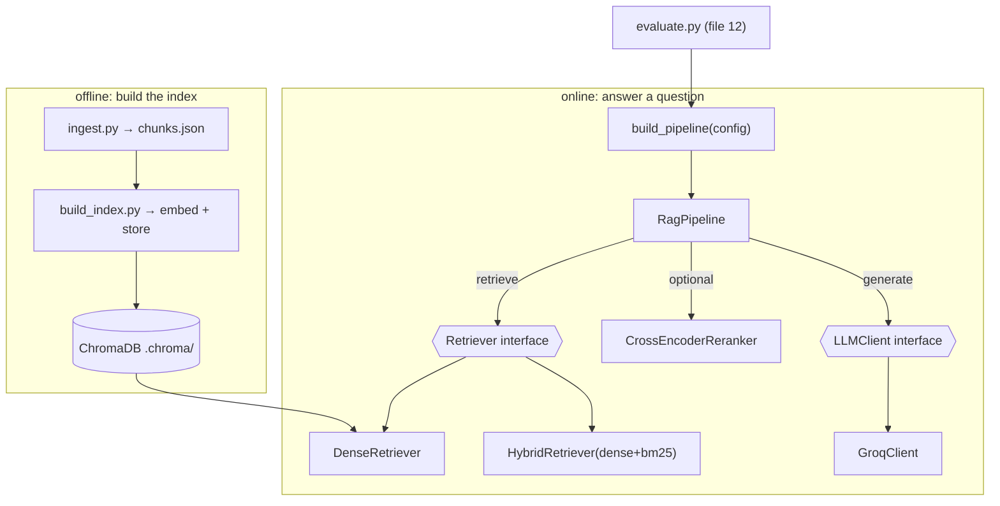

# 01 — Architecture: The RAG Pipeline, Interfaces & the Config Factory

*Subsystem: how the whole system is wired end-to-end, and the two abstractions (Retriever, LLMClient)
+ the factory that make it swappable and measurable. Code: `ingest.py`, `build_index.py`,
`src/rag/pipeline.py`, `src/rag/factory.py`, `src/retrieval/base.py`, `src/llm/base.py`.*

---

## 1. The Claim

> *"Architected a from-scratch RAG system as a clean pipeline (ingest → index → retrieve → generate)
> behind swappable `Retriever` and `LLMClient` interfaces, with a config factory that assembles
> dense / hybrid / hybrid+rerank pipelines so every upgrade can be measured against the same golden
> set."*

---

## 2. First Principles (from zero)

- **RAG (Retrieval-Augmented Generation)** = don't ask the LLM to answer from memory; first **retrieve**
  relevant source text, then have the LLM **generate** an answer grounded in it. Two halves: a
  *retrieval* system and a *generation* system.
- **Pipeline** = a fixed sequence of stages where each stage's output feeds the next:
  *retrieve → (rerank) → augment the prompt → generate*.
- **Offline vs online phases.** *Ingest* (chunk a repo) and *index* (embed + store) happen **once**,
  ahead of time. *Ask* (retrieve + generate) happens **per question**, live. Separating them keeps
  queries fast — the expensive work is pre-done.
- **Interface (abstract base class)** = a contract that says "any retriever must have `.retrieve()`",
  "any LLM must have `.generate()`" — without saying *how*. Code depends on the contract, so
  implementations swap freely ("program to an interface, not an implementation").
- **Factory** = one function that, given a config name, constructs the right object graph (which
  retriever, whether to rerank). Callers say `build_pipeline("hybrid")` and don't care how it's built.

---

## 3. How It Actually Works Under the Hood

**Two offline commands build the searchable index.** `ingest.py` walks a folder, chunks each file
(file 02), and writes `chunks.json` — a plain, inspectable artifact. `build_index.py` reads that,
embeds every chunk (file 03), and stores vectors in ChromaDB (file 04). The split means you can eyeball
the chunks before spending compute on embeddings, and re-embed without re-chunking.

**One online path answers a question.** `RagPipeline.answer()` does four things: (1) **retrieve**
`candidate_k` chunks via whatever `Retriever` it was given; (2) optionally **rerank** them down to
`top_k` with a cross-encoder; (3) **augment** — format the final chunks as numbered sources and build
the prompt; (4) **generate** — call the LLM and return the answer plus the sources it used. The
pipeline doesn't know or care *which* retriever it holds — that's the interface paying off.

**The factory is the linchpin of measurability.** `build_pipeline(config)` returns:
- `"dense"` → `RagPipeline(DenseRetriever)` — vectors only.
- `"hybrid"` → `RagPipeline(HybridRetriever(dense, bm25))` — vectors + keywords fused with RRF.
- `"hybrid_rerank"` → hybrid + a `CrossEncoderReranker`, with a bigger `candidate_k` so the reranker
  has a pool to pick from.
Because all three produce the *same* `RagPipeline` interface, the evaluator (file 12) can score each on
one golden set and *prove* which upgrade helps — the entire reason the codebase is structured this way.

**Dependency direction.** Entry-point scripts (`ask.py`, `ask_agent.py`, `app.py`, `evaluate.py`) →
factory → pipeline → interfaces → concrete implementations. Nothing high-level imports a vendor
directly; the vendor lives at the leaf, behind an interface.

---

## 4. Diagram

### ASCII — offline build vs online answer
```
  OFFLINE (once)                                   ONLINE (per question)
  ─────────────                                    ─────────────────────
  repo/docs ─ ingest.py ─► chunks.json             question
                 │ (file 02: AST/heading chunks)      │
                 ▼                                     ▼
           build_index.py ─► embed (file 03)      build_pipeline(config)  ← factory
                 │           store  (file 04)          │  dense | hybrid | hybrid_rerank
                 ▼                                     ▼
            .chroma/  (HNSW index)          RagPipeline.answer():
                                              1 retrieve (Retriever iface)  files 05-07
                                              2 rerank?  (cross-encoder)     file 08
                                              3 augment  (numbered sources)  file 09
                                              4 generate (LLMClient iface)   file 11
                                                    │
                                                    ▼
                                            cited answer + sources
```

### Mermaid — the swappable object graph


---

## 5. How It Works in Code-Intel Engine (real code)

**The pipeline — retriever + optional reranker, decoupled from both (`src/rag/pipeline.py`):**
```python
class RagPipeline:
    def __init__(self, retriever, reranker=None, top_k=5, candidate_k=10):
        self.retriever = retriever          # ANY Retriever (dense/hybrid) — interface, not a class
        self.reranker  = reranker
        self.llm = get_llm()                # ANY LLMClient — resolved by the provider factory
        self.candidate_k = candidate_k if reranker else top_k   # retrieve more if reranking

    def retrieve(self, question):
        hits = self.retriever.retrieve(question, k=self.candidate_k)
        return self.reranker.rerank(question, hits, top_n=self.top_k) if self.reranker else hits[:self.top_k]

    def answer(self, question):
        hits = self.retrieve(question)
        user = f"Sources:\n{_format_sources(hits)}\n\nQuestion: {question}"
        return self.llm.generate(SYSTEM_PROMPT, user), hits
```

**The factory — one place that assembles each config (`src/rag/factory.py`):**
```python
def build_pipeline(config="dense", chunks_path="chunks.json", top_k=5):
    dense = DenseRetriever(Embedder(), VectorStore())
    if config == "dense":         return RagPipeline(dense, top_k=top_k)
    if config == "hybrid":        return RagPipeline(HybridRetriever(dense, BM25Retriever(load_corpus(chunks_path))), top_k=top_k)
    if config == "hybrid_rerank": return RagPipeline(hybrid, reranker=CrossEncoderReranker(), top_k=top_k, candidate_k=15)
    raise ValueError(f"Unknown config: {config!r}")
```

**The two interfaces everything depends on (`base.py` files):**
```python
class Retriever(ABC):
    @abstractmethod
    def retrieve(self, query: str, k: int) -> list[Hit]: ...
class LLMClient(ABC):
    @abstractmethod
    def generate(self, system: str, user: str) -> str: ...
```

---

## 6. Why I Chose This

- **Ingest/index/ask separation** keeps the expensive work (chunk + embed) offline and one-time, so
  answering a question stays fast and cheap.
- **`chunks.json` as a visible artifact** makes chunking debuggable by eye and lets me re-embed without
  re-chunking (and rebuild the index on ephemeral hosts, file 13).
- **Two interfaces (Retriever, LLMClient)** are the backbone of the whole design: they let me build
  multiple retrievers and providers and *swap or compare* them without touching the answering logic.
- **A config factory** turns "which retrieval is best?" into a one-word change and an evaluation run —
  measurability is designed in, not bolted on (file 12).
- **From-scratch, not a framework** (no LangChain/LlamaIndex): every stage is code I can explain and
  control, which is the entire point of the project.

---

## 7. Alternatives + Comparison Table

| Concern | Chosen | Alternative | Why NOT (here) |
|---|---|---|---|
| Framework | **From-scratch pipeline** | LangChain / LlamaIndex | They hide the control flow and add heavy deps; I built it to *understand* RAG, and my pipeline is small and fully defensible |
| Structure | **Interfaces + factory** | Hard-code vector search in the pipeline | Then I couldn't add BM25/hybrid/rerank or measure them without rewriting the core |
| Build vs query | **Offline index, online ask** | Chunk+embed on every query | Re-embedding per question is absurdly slow/expensive; pre-building is the norm |
| Config selection | **One factory function** | `if/else` scattered across entry points | Duplicated wiring, easy to drift; one factory is the single source of truth |
| Intermediate artifact | **`chunks.json` on disk** | Chunk straight into the vector DB in memory | Can't inspect chunks, can't rebuild the index without re-chunking, harder to deploy |
| Coupling to a vendor | **Behind `LLMClient`/`Retriever`** | Import Groq/Chroma everywhere | Vendor lock-in scattered across the code; swapping becomes a refactor instead of one line |

---

## 8. Scenarios & Edge Cases

1. **Add a new retrieval strategy.** Implement `Retriever`, add one branch to the factory — the
   pipeline, entry points, and evaluator are untouched.
2. **Swap the LLM provider.** Set `LLM_PROVIDER=claude`, add a `ClaudeClient(LLMClient)` — nothing else
   changes (file 11).
3. **Empty index.** `pipeline.answer()` returns "The index is empty — run build_index.py first." instead
   of crashing.
4. **Re-run ingestion on unchanged code.** Stable chunk ids (file 02) mean the same chunks/ids, so the
   index rebuild is deterministic.
5. **Reranking on.** `candidate_k` jumps to 15 so the cross-encoder has a real pool to sharpen down to
   top-5 (file 08).
6. **Evaluate three configs.** `evaluate.py dense|hybrid|hybrid_rerank` each build via the factory and
   score on the same golden set — apples-to-apples (file 12).

---

## 9. How I Verified It

- **The factory + interfaces are exercised by three real entry points** (`ask.py`, `ask_agent.py`,
  `app.py`) and the evaluator, all building pipelines the same way — if the wiring were wrong, none
  would run.
- **The measurability claim is concrete:** `evaluate.py` produces a scores table per config (context
  recall / correctness / faithfulness), which is only possible because every config shares the
  `RagPipeline` interface (file 12).
- **The offline/online split is observable:** `ingest.py` prints a chunk summary and writes
  `chunks.json`; `build_index.py` prints the stored count; `ask.py` prints the answer + the sources it
  used — each stage is inspectable.

---

## 10. Interview Q&A (easy → hard)

**Q (easy). What is RAG in one sentence?** "Retrieve relevant source text for a question, put it in the
prompt, and have the LLM answer grounded in it with citations — instead of answering from memory."

**Q (easy). Walk the pipeline.** "Offline: ingest chunks a repo into chunks.json, build_index embeds and
stores them. Online: retrieve candidate chunks, optionally rerank, format them as numbered sources,
and generate a cited answer."

**Q (medium). Why separate ingest from index from ask?** "So the expensive work — chunking and
embedding — happens once, offline, and answering stays fast. It also lets me inspect chunks.json before
embedding and rebuild the index without re-chunking."

**Q (medium). Why the Retriever and LLMClient interfaces?** "To program to an interface, not an
implementation. They let me build dense, hybrid, and reranked retrievers, and swap LLM providers,
without touching the answering logic — and they're what make head-to-head evaluation possible."

**Q (medium). What does the factory buy you?** "One function assembles any config — dense, hybrid,
hybrid_rerank — so switching strategies is a single word, and the evaluator can score all three on the
same golden set to prove which is best."

**Q (hard). How would you add a completely new retriever, end to end?** "Subclass `Retriever` with a
`retrieve()` method, add a branch in `build_pipeline`, and add its name to the evaluator's config list.
Nothing in the pipeline, prompt, or entry points changes — that's the interface doing its job."

**Q (hard). Why from-scratch instead of LangChain?** "To own and explain every mechanic — chunking,
RRF, reranking, the agent loop. Frameworks abstract those away, which is fine for shipping but bad for a
project whose whole purpose is demonstrating I understand production RAG. My pipeline is a few hundred
lines I can defend end to end, and the interfaces mean I'm not locked out of swapping in a framework
later."

**Q (curveball). Where's the biggest risk in this architecture?** "Retrieval quality — if the right
chunk isn't retrieved, no prompt saves the answer. That's why so much of the design (chunking, hybrid,
rerank) targets recall/precision, and why the eval harness measures context recall specifically."

---

## 11. Traps to Avoid

- ❌ Don't describe RAG as "the LLM reads the repo" — it only sees retrieved chunks in the prompt.
- ❌ Don't forget the offline/online split — it's the first "why is it fast?" answer.
- ❌ Don't say the pipeline "does vector search" — it does *whatever Retriever it's given*; that's the point.
- ❌ Don't undersell the factory — it's what makes evaluation apples-to-apples.
- ❌ Don't claim "no framework" as laziness — frame it as owning the mechanics, with interfaces keeping
  the door open.

---

⬅️ Prev: [`F2-llms-tokens-prompting.md`](F2-llms-tokens-prompting.md) ·
➡️ Next: [`02-chunking-ast-and-structural.md`](02-chunking-ast-and-structural.md) ·
🔗 Related: [`11-llm-abstraction.md`](11-llm-abstraction.md), [`12-evaluation-and-judge.md`](12-evaluation-and-judge.md)
