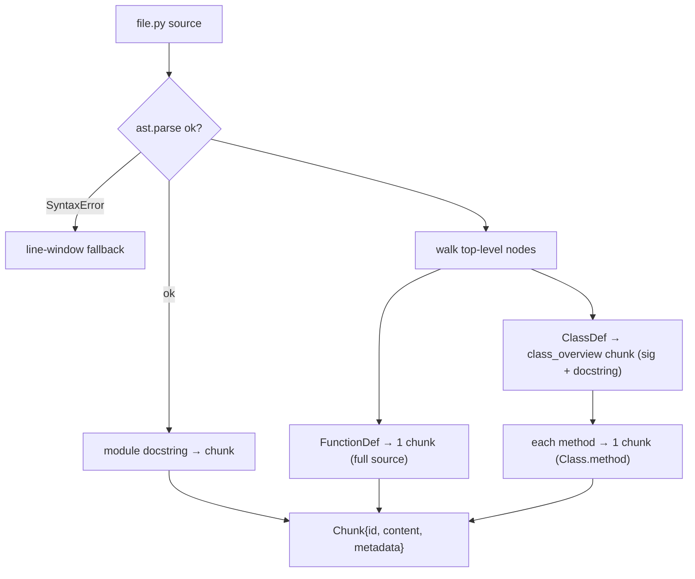

# 02 — Chunking: AST-Aware (Python) + Structural (Markdown) + a Safe Fallback

*Subsystem: how a repo becomes retrievable units. This is the highest-leverage part of the whole
system — garbage chunks mean garbage retrieval. Code: `src/chunking/base.py`, `dispatcher.py`,
`python_chunker.py`, `markdown_chunker.py`.*

---

## 1. The Claim

> *"Chunked code on *logical* boundaries using Python's AST (whole functions, class overviews, one
> chunk per method) and docs on heading structure with breadcrumb metadata — with a dispatcher that
> falls back to overlapping line-windows so no file is ever dropped, and stable chunk ids for precise
> incremental updates."*

---

## 2. First Principles (from zero)

- **Chunk** = the atomic unit of the whole system — the text that gets embedded, retrieved, and shown
  to the LLM. Everything downstream operates on chunks, so their quality caps the system's quality.
- **Why not embed whole files?** A file is too big — it dilutes meaning into one blurry vector, and it
  overflows the LLM's context window. You must split.
- **Naive (fixed-size) chunking** = cut every N characters/lines. Simple, but it slices a function in
  half; the retriever then returns "half a function", useless to both the embedder and the LLM.
- **Structural chunking** = split on *meaning* boundaries: a whole function, a class method, a doc
  section under a heading. Each chunk is a self-contained idea.
- **AST (Abstract Syntax Tree)** = the tree representation of source code the interpreter itself uses:
  "this is a function `login`, lines 10–25, here's its body." Python's stdlib `ast` gives it for free,
  no external parser.
- **Breadcrumb** = the chain of parent headings for a doc section (e.g. `Deployment > Kubernetes >
  Config`). It disambiguates an otherwise generic section title.
- **Stable id** = a deterministic chunk identifier (`file.py::Class.method`) that's the same across
  re-runs on unchanged code — enabling precise update/delete instead of full rebuilds.
- **Overlap** = adjacent fallback windows share a few lines so an idea split across a boundary still
  appears (partially) in both neighbours.

---

## 3. How It Actually Works Under the Hood

**The `Chunk` shape is deliberately tiny:** `chunk_id`, `content`, and a free-form `metadata` dict. Small
so it's stable, and the dict means I can add fields (git blame, imports…) later without changing the
class. `content` is what gets embedded and shown; `metadata` carries file/language/kind/line-numbers.

**Python → AST chunker.** `ast.parse(source)` builds the tree; a `SyntaxError` returns `[]` so the
dispatcher can fall back (never crash a whole run for one bad file). Then it walks **top-level**
statements and emits: one chunk for the module docstring, one per top-level function (full source via
`ast.get_source_segment`), a small **class overview** chunk (signature + docstring — *not* the whole
class, which would drown retrieval), and **one chunk per method**. IDs are qualified:
`app.py::UserService.login`. It deliberately doesn't recurse into nested functions — simple and
predictable for now.

**Markdown → structural chunker.** A one-line heading regex plus an **ancestor stack**: on each heading,
flush the buffered section, pop stack entries at the same-or-deeper level (so the stack holds only true
ancestors), push the new heading, and record the **breadcrumb**. Each section becomes a chunk with its
heading, breadcrumb, and level in metadata. The breadcrumb is gold for retrieval — "Configuration" alone
is ambiguous, but "Deployment > Kubernetes > Configuration" tells the LLM exactly where it sits.

**The dispatcher = strategy + safety net.** `.py` → AST (fallback to line-windows if unparseable);
`.md/.markdown` → structural; everything else → overlapping line-windows (60-line windows, 10-line
overlap). The fallback is a principle: *a rough chunk beats no chunk* — never silently drop a file
because we lack a fancy parser for its language yet. Binary/unreadable files are skipped entirely.

---

## 4. Diagram

### ASCII — one dispatcher, three strategies
```
                       chunk_file(path)
                             │  read text (skip binary/unreadable)
              ┌──────────────┼─────────────────────────┐
          .py │          .md/.markdown │        everything else
              ▼                        ▼                 ▼
        chunk_python              chunk_markdown     _chunk_fallback
        (AST)                     (heading stack)    (60-line windows,
          │  parse ok?              │  per section     10 overlap)
          │  ├ yes → module doc     │  + breadcrumb
          │  │       + functions    │  + level
          │  │       + class overview
          │  │       + 1 per method
          │  └ SyntaxError → [] ───► fallback (never lose the file)
              ▼                        ▼                 ▼
                    list[Chunk] { chunk_id, content, metadata }
```

### Mermaid — Python file to logical chunks


---

## 5. How It Works in Code-Intel Engine (real code)

**The atomic unit (`src/chunking/base.py`):**
```python
@dataclass
class Chunk:
    chunk_id: str                 # stable, e.g. "src/app.py::UserService.login"
    content: str                  # the text that gets embedded + shown to the LLM
    metadata: dict = field(default_factory=dict)   # file, language, kind, line numbers...
```

**AST chunking — class overview + one chunk per method (`python_chunker.py`):**
```python
for node in tree.body:                              # top-level only
    if isinstance(node, (ast.FunctionDef, ast.AsyncFunctionDef)):
        emit(node, "function", node.name, ast.get_source_segment(source, node))
    elif isinstance(node, ast.ClassDef):
        emit(node, "class_overview", node.name, _class_overview(node, source))  # sig + docstring, NOT whole class
        for item in node.body:                       # each method → its own chunk
            if isinstance(item, (ast.FunctionDef, ast.AsyncFunctionDef)):
                emit(item, "method", f"{node.name}.{item.name}", ast.get_source_segment(source, item))
```

**Markdown breadcrumbs via an ancestor stack (`markdown_chunker.py`):**
```python
while stack and stack[-1][0] >= level:   # pop same-or-deeper headings
    stack.pop()
stack.append((level, title))             # push this heading
# metadata: {"breadcrumb": ["Deploy","K8s","Config"], "heading": title, "level": level}
```

**Dispatcher = strategy + fallback (`dispatcher.py`):**
```python
if ext == ".py":
    chunks = chunk_python(path, source, repo_root)
    return chunks if chunks else _chunk_fallback(path, source, repo_root)   # never lose a file
if ext in (".md", ".markdown"):
    return chunk_markdown(path, source, repo_root)
return _chunk_fallback(path, source, repo_root)
```

---

## 6. Why I Chose This

- **AST/structural over fixed-size** because chunk quality *is* retrieval quality. A whole function is a
  meaningful, embeddable unit; half a function is noise. This single decision does more for answer
  quality than any downstream tuning.
- **Class overview + per-method chunks**, not one giant class chunk, because a big class would produce
  one dominant vector that drowns everything else and blows the context budget. Small, targeted chunks
  retrieve precisely.
- **Breadcrumbs in metadata** because doc section titles are ambiguous alone; the heading path gives the
  LLM (and the reader) exact location context.
- **A universal fallback** because robustness matters more than elegance: a rough line-window chunk for
  an unsupported language beats dropping the file and losing that knowledge entirely.
- **Stable, qualified ids** so re-indexing unchanged code is deterministic and future incremental
  updates (update/delete one chunk) are possible without a full rebuild.

---

## 7. Alternatives + Comparison Table

| Concern | Chosen | Alternative | Why NOT (here) |
|---|---|---|---|
| Split strategy | **AST (code) / heading (docs)** | Fixed-size character/line chunks | Cuts functions/sections in half → retrieves fragments, useless to embedder + LLM |
| Split strategy | **AST** | Recursive character splitter (LangChain) | Still structure-blind; AST knows true function/class boundaries with zero deps |
| Multi-language | **stdlib `ast` (Python) + fallback** | `tree-sitter` for all languages now | tree-sitter is the right upgrade but heavier to set up; it's on the roadmap. Fallback covers other langs meanwhile |
| Class handling | **Overview + per-method chunks** | One chunk per whole class | A huge class chunk dominates retrieval and overflows context |
| Doc parsing | **Heading regex + stack** | Full Markdown AST (markdown-it) | I only need sections + breadcrumbs; a regex + stack does it with no dependency |
| Robustness | **Fallback line-windows** | Skip files we can't parse | Silently losing files loses knowledge; a rough chunk is better than none |
| Chunk id | **Stable qualified id** | Random UUID per run | UUIDs change every run → can't do incremental update/delete or reproducible indexes |

---

## 8. Scenarios & Edge Cases

1. **A clean Python class.** Produces a `class_overview` chunk plus one `method` chunk each — precise,
   independently retrievable units with ids like `bank.py::Account.withdraw`.
2. **A Python file with a syntax error.** `ast.parse` raises → chunker returns `[]` → dispatcher falls
   back to line-windows. The file is still indexed, nothing crashes.
3. **A deeply nested doc heading.** The stack yields a full breadcrumb (`Deploy > K8s > Config`), so a
   generic "Config" section is unambiguous in retrieval.
4. **An unsupported language (.go/.rb).** Falls to overlapping line-windows — indexed, searchable, just
   not AST-precise. (tree-sitter would upgrade this.)
5. **An idea split across a fallback window boundary.** The 10-line overlap means it appears in both
   neighbouring windows, so retrieval can still find it.
6. **A giant function > 4000 chars.** `ingest.py` flags oversized chunks — a known follow-up is
   sub-splitting them, because very large chunks hurt retrieval precision.
7. **Binary/unreadable file.** `read_text` raises `UnicodeDecodeError` → skipped entirely, no crash.

---

## 9. How I Verified It

- **`ingest.py` prints a summary you eyeball:** counts by language and by kind
  (`module_doc/function/class_overview/method/section/line_window`) and chunk-size min/avg/max — the
  fastest way to sanity-check a chunker is to read a few of its chunks, and `chunks.json` is written
  precisely so I can.
- **The oversized-chunk warning** surfaces chunks > 4000 chars as an explicit talking point / future
  sub-split target.
- **End-to-end proof via evaluation** (file 12): if chunking were bad, *context recall* would drop
  because the answer-bearing chunk wouldn't be a clean retrievable unit — so a high recall score is
  downstream evidence the chunking works.

---

## 10. Interview Q&A (easy → hard)

**Q (easy). What's a chunk and why chunk at all?** "A chunk is the atomic unit we embed and retrieve.
We chunk because whole files are too big — they dilute meaning into one vector and overflow the LLM's
context. Chunking splits a file into retrievable pieces."

**Q (easy). Why not just split every 500 characters?** "Because it cuts a function in half. You'd
retrieve half a function, which is useless to the embedding model and the LLM. I split on logical
boundaries so each chunk is a complete idea."

**Q (medium). What is an AST and how do you use it?** "The Abstract Syntax Tree is the structured
representation of code the interpreter uses. Python's stdlib `ast` parses a file into it, so I can walk
functions, classes, and methods and emit each as its own chunk with correct line numbers — no external
parser."

**Q (medium). Why a class overview plus per-method chunks instead of one class chunk?** "A whole class
becomes one giant chunk that dominates retrieval and eats the context budget. So the class gets a small
overview (signature + docstring) and each method becomes its own precise chunk."

**Q (medium). What are breadcrumbs and why store them?** "For docs, a section's chain of parent headings
— like 'Deployment > Kubernetes > Config'. A title like 'Config' is ambiguous alone; the breadcrumb
tells retrieval and the LLM exactly where the section lives."

**Q (hard). How do you handle files you can't parse or don't support?** "Two layers. If a Python file
has a syntax error, the AST chunker returns empty and the dispatcher falls back to overlapping
line-windows. Unsupported languages go straight to that fallback. The principle is a rough chunk beats
no chunk — never silently drop a file. tree-sitter is the roadmap upgrade for true multi-language AST."

**Q (hard). Why stable chunk ids and what do they enable?** "Ids like `file.py::Class.method` are
deterministic across runs on unchanged code. That makes re-indexing reproducible and enables precise
incremental update/delete of a single chunk later instead of rebuilding the whole index."

**Q (curveball). What's the biggest weakness of your chunking today?** "It's Python-only for true AST;
everything else uses line-windows, and very large functions aren't sub-split yet. Both are known: I flag
oversized chunks in ingest, and tree-sitter + sub-splitting are the planned fixes. I'd rather name that
than pretend it's universal."

---

## 11. Traps to Avoid

- ❌ Don't call fixed-size chunking "fine" — the interviewer wants to hear *why* it's harmful (half a function).
- ❌ Don't say you chunk the whole class into one piece — it's overview + per-method.
- ❌ Don't forget the fallback — robustness ("never drop a file") is a real design decision.
- ❌ Don't claim multi-language AST — it's Python AST + fallback; tree-sitter is roadmap.
- ❌ Don't overlook breadcrumbs/metadata — they're a genuine retrieval booster, not decoration.
- ❌ Don't use random ids — stable ids are what enable incremental updates.

---

⬅️ Prev: [`01-architecture-and-pipeline.md`](01-architecture-and-pipeline.md) ·
➡️ Next: [`03-embeddings-model.md`](03-embeddings-model.md) ·
🔗 Related: [`04-vector-store-and-ann.md`](04-vector-store-and-ann.md), [`06-bm25-keyword-retrieval.md`](06-bm25-keyword-retrieval.md)
