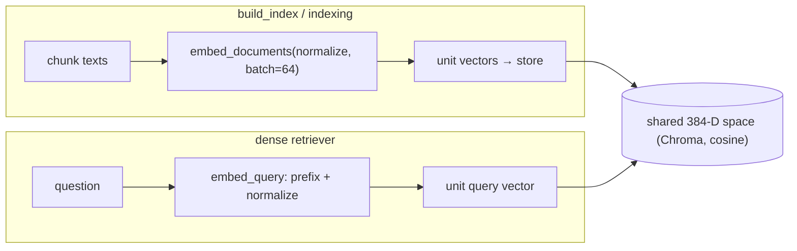

# 03 — Embeddings: The Local Model, Asymmetric Query/Doc & Normalization

*Subsystem: turning chunk text into vectors that capture meaning. Code: `src/embeddings/embedder.py`,
used by `build_index.py`, `src/indexing.py`, `src/retrieval/dense.py`.*

---

## 1. The Claim

> *"Embedded chunks with a local, open-source model (`bge-small-en-v1.5`, 384-dim) using its
> *asymmetric* query/document modes and L2-normalized vectors — so semantic search is free, private,
> fast, and mathematically clean (cosine = dot product)."*

---

## 2. First Principles (from zero)

- **Embedding** = a vector (list of numbers) produced by a neural network so that similar-meaning text
  lands at nearby points (see F1). It's what makes "search by meaning" possible.
- **Embedding model** = the network that does this. Here it's `BAAI/bge-small-en-v1.5`, a small,
  fast, open model that runs **locally** — no API, no per-call cost, no data leaving the machine.
- **Dimension** = how many numbers per vector (384 for bge-small). Fixed for a given model.
- **Local vs API embeddings.** A hosted API (OpenAI/Cohere) charges per call and receives your text; a
  local model runs on your CPU/GPU for free and keeps code private — it just needs downloading once.
- **Asymmetric embedding.** Some models (bge included) are trained so a *question* and a *passage*
  should be embedded slightly differently: the query gets a short **instruction prefix**, documents
  don't. Using the wrong mode silently lowers retrieval quality.
- **Normalization** = scaling each vector to length 1. Then cosine similarity equals the dot product
  (fast) and long chunks don't get an unfair magnitude advantage (see F1).
- **Batching** = embedding many texts in one model call for throughput (vs one-at-a-time).

---

## 3. How It Actually Works Under the Hood

**One model, loaded once.** `Embedder.__init__` constructs a `SentenceTransformer(model_name)`, which
downloads the weights on first run and caches them on disk. Loading is the expensive part, so it's done
once and reused (the Streamlit app caches the whole pipeline for the same reason, file 13).

**Two methods, because the model is asymmetric.** `embed_documents(texts)` encodes passages for storage;
`embed_query(text)` prepends the bge instruction — *"Represent this sentence for searching relevant
passages: "* — because that's how the model was trained to represent a query. Exposing both, and using
the right one in the right place (build_index uses `embed_documents`; the dense retriever uses
`embed_query`), is what keeps recall high. Getting this backwards is a classic silent quality bug.

**Normalized so cosine = dot product.** Both methods pass `normalize_embeddings=True`, giving unit-length
vectors. Downstream, the vector store compares with cosine (file 04); because the vectors are unit
length, cosine reduces to a single dot product — cheap and length-invariant.

**Batching for documents.** `embed_documents` uses `batch_size=64` so indexing a repo is fast; a single
query obviously needs no batching.

**Version resilience.** `dimension` reads the embedding size via `get_embedding_dimension` or the older
`get_sentence_embedding_dimension` — the method was renamed across `sentence-transformers` versions, so
supporting both avoids a brittle crash on upgrade.

---

## 4. Diagram

### ASCII — asymmetric embedding, one space
```
  BUILD TIME (documents)                         QUERY TIME (a question)
  ──────────────────────                         ───────────────────────
  chunk text                                     "how do I deposit money?"
      │ embed_documents (no prefix)                   │ embed_query
      │ normalize, batch=64                           │ PREPEND "Represent this sentence
      ▼                                               │   for searching relevant passages: "
  [384 floats, len 1] ─► stored in Chroma            │ normalize
                                                      ▼
                                             [384 floats, len 1] ─► ANN search
                    both live in the SAME vector space; cosine = dot product
```

### Mermaid — the Embedder's two modes


---

## 5. How It Works in Code-Intel Engine (real code)

**Two modes + normalization (`src/embeddings/embedder.py`):**
```python
MODEL_NAME = "BAAI/bge-small-en-v1.5"
_QUERY_INSTRUCTION = "Represent this sentence for searching relevant passages: "

class Embedder:
    def __init__(self, model_name=MODEL_NAME):
        self.model = SentenceTransformer(model_name)      # downloads once, caches on disk

    def embed_documents(self, texts):
        return self.model.encode(texts, normalize_embeddings=True,   # unit length → cosine == dot
                                 batch_size=64).tolist()

    def embed_query(self, text):
        return self.model.encode(_QUERY_INSTRUCTION + text,          # ASYMMETRIC: prefix the query only
                                 normalize_embeddings=True).tolist()
```

**Used correctly at each site:**
```python
# build_index.py — passages:
embeddings = embedder.embed_documents(documents)
# src/retrieval/dense.py — the question:
query_vector = self.embedder.embed_query(query)
```

---

## 6. Why I Chose This

- **A local open model** because embeddings are called on *every* chunk at index time and *every*
  query — a paid API would cost money and leak the codebase to a third party. bge-small is free,
  private, fast, and near-SOTA for its size.
- **`small` (384-dim)** hits the speed/RAM/quality sweet spot for a single-machine corpus; a larger
  model buys marginal recall for real latency/memory, and the wrapper lets me swap up if needed.
- **Asymmetric query/doc modes** because that's how bge was trained; honoring it is free recall, and
  ignoring it is a silent quality leak.
- **Normalization** because it makes cosine similarity a cheap dot product and removes length bias — the
  clean, standard setup for text retrieval.
- **A thin `Embedder` wrapper** so the model choice is one line and every caller uses the right mode.

---

## 7. Alternatives + Comparison Table

| Concern | Chosen | Alternative | Why NOT (here) |
|---|---|---|---|
| Provider | **Local bge-small** | OpenAI `text-embedding-3` / Cohere | Per-call cost + sends code to a third party; local is free and private |
| Model size | **small (384-d)** | large/e5-large (1024-d) | More RAM/latency for marginal recall gain at this scale; swappable later |
| Library | **`sentence-transformers`** | Raw `transformers` + manual pooling | ST handles pooling/normalization/batching correctly; hand-rolling is bug-bait |
| Query handling | **Asymmetric (prefix query)** | Same encoding for query + doc | bge is trained asymmetric; wrong mode silently drops recall |
| Vector scaling | **Normalized (unit length)** | Un-normalized | Length bias favors long chunks; cosine no longer reduces to a clean dot product |
| Throughput | **Batch documents (64)** | One-by-one | Batching is far faster for indexing a whole repo |

---

## 8. Scenarios & Edge Cases

1. **First run.** The model downloads (a one-time cost), then caches — subsequent runs load from disk.
2. **Query embedded as a document (the bug).** If `embed_documents` were used for the question, the
   missing instruction prefix would measurably lower recall — which is exactly why the two methods
   exist and are used at distinct call sites.
3. **A very long chunk.** Normalization ensures it can't win purely on magnitude; only direction
   (meaning) counts.
4. **`sentence-transformers` upgraded** and renamed the dimension method → the `getattr` fallback keeps
   `dimension` working instead of crashing.
5. **Swap the model** to a larger one → change `MODEL_NAME`, re-run `build_index.py` (dimension changes,
   so the index must be rebuilt) — nothing else changes.
6. **Offline machine.** Once cached, embeddings need no network — only the final LLM call does.

---

## 9. How I Verified It

- **`build_index.py` prints the dimension** (`dimension = 384`) and the stored count, confirming the
  model loaded and every chunk was embedded.
- **Retrieval scores are sane:** `ask.py` shows on-topic chunks scoring high similarity and off-topic
  low — a direct signal the embeddings capture meaning.
- **Context recall in the eval harness** (file 12) is the end-to-end proof: if the embeddings (or the
  query/doc asymmetry) were wrong, the answer-bearing chunk wouldn't be retrieved and recall would drop.

---

## 10. Interview Q&A (easy → hard)

**Q (easy). What does the embedder do?** "Turns text into a 384-number vector that captures meaning, so
similar text ends up as nearby vectors. I use a local open model, bge-small, so it's free and private."

**Q (easy). Why a local model, not an API?** "Embeddings run on every chunk and every query — an API
would cost money per call and send my code to a third party. A local model is free, private, and fast,
and it's behind a wrapper so I can swap it."

**Q (medium). What's asymmetric embedding and why does it matter?** "bge is trained so queries and
documents are embedded slightly differently — the query gets an instruction prefix, documents don't.
Using the wrong mode silently lowers recall, so I expose `embed_query` and `embed_documents` and use
each at the right place."

**Q (medium). Why normalize the vectors?** "So each has length 1. Then cosine similarity equals the dot
product — cheap for the index — and long chunks can't win on magnitude. It's the standard clean setup
for semantic search."

**Q (hard). Would a bigger embedding model help?** "It would raise recall a bit but cost more RAM and
latency, which isn't worth it at this corpus size. Because embeddings sit behind the `Embedder` wrapper,
I can swap to a larger model and re-index — the retrieval code doesn't change. Rebuilding is required
because the vector dimension changes."

**Q (hard). Where can embeddings alone go wrong here?** "Exact identifiers and rare tokens — a specific
function name or error code may embed weakly. That's why I add BM25 keyword search and fuse the two
(file 07), and rerank with a cross-encoder (file 08). Embeddings handle meaning; the others handle exact
matches and precision."

**Q (curveball). How do you know the query prefix actually helps?** "It's the model authors'
recommendation, and I'd confirm it empirically with the eval harness — run context recall with and
without the prefix. The harness exists precisely to turn 'should help' into a measured number."

---

## 11. Traps to Avoid

- ❌ Don't forget the asymmetry — same encoding for query and doc is a silent recall bug.
- ❌ Don't say "bigger model is always better" — it's a speed/quality trade-off; small is right here.
- ❌ Don't skip normalization in your explanation — it's what makes cosine == dot product.
- ❌ Don't claim embeddings handle exact identifiers well — that's BM25's job (file 06).
- ❌ Don't forget that swapping model dimension forces an index rebuild.

---

⬅️ Prev: [`02-chunking-ast-and-structural.md`](02-chunking-ast-and-structural.md) ·
➡️ Next: [`04-vector-store-and-ann.md`](04-vector-store-and-ann.md) ·
🔗 Related: [`F1-vectors-embeddings-similarity.md`](F1-vectors-embeddings-similarity.md), [`05-dense-retrieval.md`](05-dense-retrieval.md)
