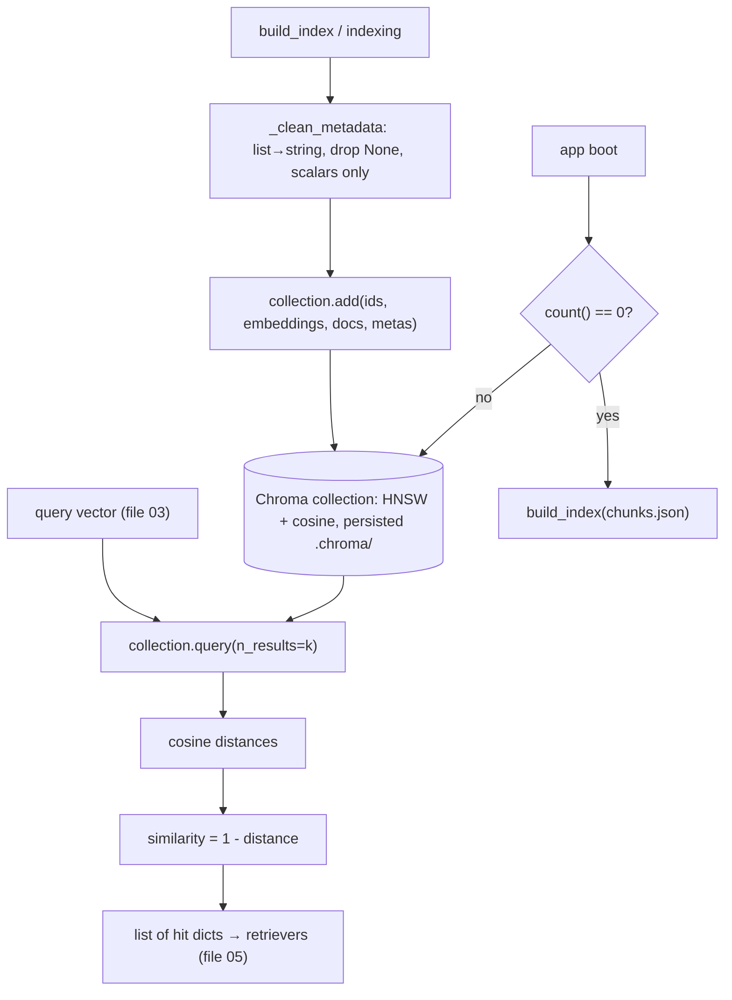

# 04 — Vector Store & ANN: ChromaDB, HNSW, Cosine & the Metadata Contract

*Subsystem: where chunk vectors live and how "find the nearest vectors" runs fast. Code:
`src/store/vector_store.py`, `src/indexing.py`.*

---

## 1. The Claim

> *"Stored chunk embeddings in an embedded ChromaDB collection using HNSW approximate-nearest-neighbour
> search over cosine distance, with a metadata-cleaning layer for Chroma's type rules and a
> distance→similarity conversion — plus an `ensure_index` path that rebuilds from `chunks.json` on
> ephemeral hosts."*

---

## 2. First Principles (from zero)

- **Vector database** = storage + fast search for embeddings. Its job: given a query vector, return the
  stored vectors closest to it — quickly, even with many vectors.
- **Why not a Python list?** Comparing a query against every stored vector is O(N) per query — fine for
  hundreds, slow at thousands, hopeless at millions.
- **ANN (Approximate Nearest Neighbour)** = find *near*-closest vectors without scanning all of them.
  **HNSW** is the graph-based ANN index that does it in ~log N (see F1).
- **Embedded database** = runs *inside* your Python process and persists to a local folder — no server
  to start. (Chroma's `PersistentClient` → `.chroma/`.)
- **Cosine distance vs similarity.** Chroma returns a *distance* (0 = identical, up to 2 = opposite);
  humans prefer a *similarity* (1 = identical). Convert: `similarity = 1 − distance`.
- **Metadata** = the non-vector fields stored beside each chunk (file, kind, breadcrumb…). Chroma only
  allows scalar metadata (`str/int/float/bool`) — no lists or `None` — so it must be cleaned.
- **Ephemeral filesystem** = many hosting platforms wipe local files on restart, so a built index can
  vanish; you need a way to rebuild it on boot.

---

## 3. How It Actually Works Under the Hood

**Collection = HNSW over cosine.** `get_or_create_collection(..., metadata={"hnsw:space": "cosine"})`
tells Chroma to build an HNSW graph and compare vectors with cosine distance — matching the normalized
embeddings from file 03. `PersistentClient(path=".chroma")` means everything is saved to disk and
survives restarts.

**Add = ids + vectors + documents + cleaned metadata.** `add()` stores four parallel lists. Metadata
runs through `_clean_metadata`: lists (like `breadcrumb`) are flattened to a `" > "` string, `None` is
dropped, and non-scalars are stringified — because Chroma rejects anything but scalars. Skipping this
would throw at insert time.

**Query = nearest-k, then reshape.** `query(query_embedding, n_results)` asks HNSW for the k nearest and
returns Chroma's raw "lists-of-lists" (one inner list per query; we send one). The code zips
documents/metadatas/distances/ids together and converts each distance to `similarity = round(1 − dist,
4)`, yielding a clean list of hit dicts the retrievers consume (file 05).

**Reset for clean rebuilds.** `reset()` deletes and recreates the collection so re-running
`build_index.py` doesn't create duplicate entries — idempotent indexing.

**`ensure_index` for deployment.** Hosted apps have ephemeral disks, so the built `.chroma/` may be gone
on restart. `ensure_index` checks `VectorStore().count() == 0` and, if empty, rebuilds from the
committed `chunks.json`. That's why the repo ships `chunks.json` (small, diffable) but **not** the
`.chroma/` binary folder (file 13).

---

## 4. Diagram

### ASCII — store, query, and the deploy rebuild
```
  BUILD                                   QUERY                         DEPLOY (ephemeral FS)
  ─────                                   ─────                         ─────────────────────
  chunks + vectors                        query vector                  app boot
     │ _clean_metadata                        │ HNSW nearest-k             │ ensure_index()
     │ (list→"a > b", drop None)              ▼                            ▼ count()==0 ?
     ▼                                    Chroma returns cosine DIST    yes → build_index(chunks.json)
  collection.add(ids, embeddings,             │  similarity = 1 - dist   no  → use existing .chroma/
     documents, metadatas)                     ▼
  metadata={"hnsw:space":"cosine"}        [{chunk_id, content, metadata, similarity}]
  reset() first → no duplicates
```

### Mermaid — query path + metadata contract


---

## 5. How It Works in Code-Intel Engine (real code)

**Cosine HNSW collection + metadata cleaning (`src/store/vector_store.py`):**
```python
self.collection = self.client.get_or_create_collection(
    name=collection, metadata={"hnsw:space": "cosine"})   # HNSW ANN over cosine

def _clean_metadata(meta):                                # Chroma allows only scalars
    clean = {}
    for k, v in meta.items():
        if v is None: continue
        clean[k] = " > ".join(map(str, v)) if isinstance(v, list) else v   # flatten breadcrumb
    return clean
```

**Query → similarity (`src/store/vector_store.py`):**
```python
res = self.collection.query(query_embeddings=[query_embedding], n_results=n_results,
                            include=["documents", "metadatas", "distances"])
for doc, meta, dist, cid in zip(res["documents"][0], res["metadatas"][0], res["distances"][0], res["ids"][0]):
    hits.append({"chunk_id": cid, "content": doc, "metadata": meta,
                 "similarity": round(1.0 - dist, 4)})     # distance → similarity
```

**Idempotent build + ephemeral-host rebuild (`src/indexing.py`):**
```python
def build_index(chunks_path="chunks.json"):
    store = VectorStore(); store.reset()                  # fresh → no duplicates
    store.add(ids=..., embeddings=Embedder().embed_documents(...), documents=..., metadatas=...)
    return store.count()

def ensure_index(chunks_path="chunks.json"):
    if VectorStore().count() == 0:                        # first boot on a fresh host
        build_index(chunks_path)
```

---

## 6. Why I Chose This

- **Embedded ChromaDB** because a single-machine learning project shouldn't run a database server or pay
  for a SaaS index. Chroma runs in-process, persists to a folder, and speaks the same "add/query"
  interface I'd use for a bigger store later.
- **HNSW/ANN** because search must stay fast as the corpus grows; brute force doesn't scale. The tiny
  approximation is invisible in practice.
- **Cosine distance** to match the normalized embeddings — semantic closeness is about direction.
- **A metadata-cleaning layer** because Chroma's scalar-only rule would otherwise crash on the
  `breadcrumb` list; flattening keeps the useful location context.
- **`ensure_index` + shipping `chunks.json`, not `.chroma/`** because hosted filesystems are ephemeral;
  rebuilding from a small, diffable artifact is more robust than committing a large opaque binary index.

---

## 7. Alternatives + Comparison Table

| Concern | Chosen | Alternative | Why NOT (here) |
|---|---|---|---|
| Vector DB | **ChromaDB (embedded)** | Qdrant / Weaviate / Milvus (servers) | Need a running server; overkill for one machine. Same interface swap later |
| Vector DB | **ChromaDB** | Pinecone (SaaS) | Paid account + network dependency; Chroma is free and local |
| Vector DB | **ChromaDB** | pgvector (Postgres) | Great if you already run Postgres; here it'd add a DB to operate for no gain |
| Index type | **HNSW** | Flat/brute-force | O(N) per query — doesn't scale beyond small corpora |
| Index type | **HNSW** | IVF | Needs a train/cluster step + tuning; HNSW works out of the box |
| Distance | **Cosine** | Euclidean/L2 | Magnitude-sensitive; meaning is about direction |
| Deploy index | **Ship chunks.json, rebuild on boot** | Commit the `.chroma/` folder | Large opaque binary; ephemeral disks wipe it; chunks.json is small + diffable |
| Rebuild | **reset() before add** | Append each run | Appending duplicates every chunk on re-index |

---

## 8. Scenarios & Edge Cases

1. **A chunk has a `breadcrumb` list.** `_clean_metadata` flattens it to `"Deploy > K8s > Config"` so
   Chroma accepts it and the location context is preserved.
2. **Re-run `build_index.py`.** `reset()` wipes the collection first → exactly one copy of each chunk,
   never duplicates.
3. **Deploy to an ephemeral host.** On boot the index is empty → `ensure_index` rebuilds from
   `chunks.json`; subsequent boots reuse the persisted `.chroma/`.
4. **Query an empty index.** Returns no hits → the pipeline surfaces "run build_index.py first" instead
   of crashing (file 01).
5. **Corpus grows 100×.** HNSW keeps search ~log-time; brute force would degrade linearly.
6. **Metadata has `None`.** Dropped by the cleaner, avoiding a Chroma insert error.
7. **Need to scale beyond one machine.** Swap `VectorStore` internals to Qdrant/pgvector — the
   `add/query/count` interface stays, so retrieval code is untouched.

---

## 9. How I Verified It

- **`build_index.py` prints `store.count()`** after building, confirming every chunk was stored and is
  searchable.
- **`query()` returns sane similarities** (on-topic ≈ high, off-topic ≈ low), visible in `ask.py`/the UI
  — direct evidence the distance→similarity conversion and cosine space are correct.
- **The deploy rebuild is real:** `ensure_index` on a fresh host reconstructs the index from
  `chunks.json`, which is why the repo commits chunks.json and gitignores `.chroma/` (file 13).
- **Idempotency check:** re-running `build_index.py` yields the same `count()`, proving `reset()`
  prevents duplicate growth.

---

## 10. Interview Q&A (easy → hard)

**Q (easy). What's a vector database for?** "Storing embeddings and answering 'which stored vectors are
closest to this query vector?' fast. I use ChromaDB embedded, so it runs in my process and saves to a
folder."

**Q (easy). Why not just loop over a list of vectors?** "That's O(N) per query — fine for a few hundred
chunks, slow at thousands. A vector DB uses an ANN index (HNSW) to stay fast as the corpus grows."

**Q (medium). What is HNSW, briefly?** "A graph-based approximate-nearest-neighbour index. It links each
vector to a few neighbours across layers and greedily walks toward the query, reaching a very close
match in about log-N hops instead of scanning everything. Approximate, but very high recall."

**Q (medium). Why Chroma and not Pinecone/Qdrant?** "For a single-machine learning project I didn't want
a server or a paid SaaS. Chroma is embedded and free. I kept it behind a `VectorStore` class, so if I
needed scale I'd swap to Qdrant or pgvector without touching retrieval."

**Q (medium). Distance vs similarity in your store?** "Chroma returns cosine *distance* — 0 is identical.
I convert to *similarity* = 1 − distance so scores read intuitively (1 = identical). It's just for
readability; ranking is the same either way."

**Q (hard). Why clean metadata, and what would break without it?** "Chroma only allows scalar metadata —
str, int, float, bool. My chunks carry a `breadcrumb` *list* and sometimes `None`. Without cleaning,
`add()` throws. So I flatten lists to a string and drop Nones, preserving the location context Chroma
can store."

**Q (hard). How do you handle deployment where the disk is wiped?** "I don't commit the built `.chroma/`
— it's large, opaque, and gets wiped on ephemeral hosts. Instead I commit the small `chunks.json` and
call `ensure_index` on boot: if the index is empty, it rebuilds from chunks.json. So the app self-heals
its index on first run."

**Q (curveball). What's the failure mode of ANN, and does it matter here?** "HNSW is approximate, so it
can occasionally miss the true nearest neighbour. In practice recall is very high, and the reranker
(file 08) re-sorts the candidates anyway, so a slightly imperfect first-stage order gets corrected.
For this corpus it's a non-issue."

---

## 11. Traps to Avoid

- ❌ Don't call ANN exact — it's approximate; that's the speed trade-off.
- ❌ Don't forget the metadata scalar rule — the breadcrumb list is the concrete gotcha.
- ❌ Don't say you commit the `.chroma/` folder — you ship chunks.json and rebuild.
- ❌ Don't confuse distance and similarity — Chroma gives distance; you flip it.
- ❌ Don't forget `reset()` — without it, re-indexing duplicates every chunk.
- ❌ Don't claim Chroma scales horizontally — it's single-machine; Qdrant/pgvector is the scale path.

---

⬅️ Prev: [`03-embeddings-model.md`](03-embeddings-model.md) ·
➡️ Next: [`05-dense-retrieval.md`](05-dense-retrieval.md) ·
🔗 Related: [`F1-vectors-embeddings-similarity.md`](F1-vectors-embeddings-similarity.md), [`13-ui-and-deployment.md`](13-ui-and-deployment.md)
