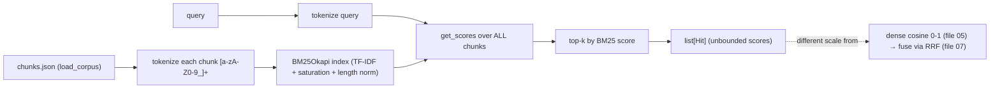

# 06 — BM25 Keyword Retrieval: Lexical / Sparse Search for Exact Identifiers

*Subsystem: retrieval by *exact words* — the complement to semantic search. Code:
`src/retrieval/bm25.py`, `src/retrieval/base.py` (`load_corpus`).*

---

## 1. The Claim

> *"Added lexical BM25 retrieval over tokenized chunks so exact identifiers, error codes, and rare
> terms — which semantic search under-ranks — are matched precisely; it implements the same `Retriever`
> interface so it fuses cleanly with dense search."*

---

## 2. First Principles (from zero)

- **Lexical / keyword search** = match on the *actual words*, not meaning. If you search
  `evaluateServiceability`, you want documents that literally contain that token.
- **Sparse vector** = represent a document by word counts across the whole vocabulary — a huge vector
  that's mostly zeros (only the words present are non-zero). Contrast with dense embeddings (F1).
- **TF-IDF** = the classic keyword score: **Term Frequency** (how often a word appears in a doc) ×
  **Inverse Document Frequency** (rare words across the corpus count more). Common words like "the"
  contribute little; distinctive words contribute a lot.
- **BM25** = TF-IDF's better-calibrated successor, the long-time backbone of search engines. It adds
  two fixes: **term-frequency saturation** (the 10th occurrence of a word adds less than the 2nd — you
  can't game it by repeating a word) and **length normalization** (long documents don't win just for
  being long).
- **Tokenization** = splitting text into comparable units. Here: lowercase word/identifier tokens via a
  regex, so `Account.deposit` and `deposit` both surface the token `deposit`.
- **Why keep the corpus in memory?** BM25 scores a query against *all* documents, so it needs the whole
  tokenized corpus available — loaded once from `chunks.json`.

---

## 3. How It Actually Works Under the Hood

**Build once.** `BM25Retriever.__init__` takes the corpus (loaded from `chunks.json` via `load_corpus`),
tokenizes every chunk once with `_tokenize` (regex `[a-zA-Z0-9_]+`, lowercased), and constructs a
`BM25Okapi` index over those token lists. Tokenizing on `[a-zA-Z0-9_]+` is deliberately code-friendly:
it keeps underscores and digits, so identifiers like `STRIPE_SECRET_KEY` or `P2002` stay intact as
searchable tokens.

**Score at query time.** `retrieve(query, k)` tokenizes the query the same way, calls
`bm25.get_scores(...)` to score the query against *every* chunk, then takes the indices of the top-k
highest scores and returns those chunks with their BM25 `score`. Because it scores all documents, it's a
full pass over the corpus — cheap at this scale, and exact.

**Why it complements dense search.** Code is full of exact identifiers that carry little "meaning" for
an embedding model — a function name, an error code, a config key. Semantic search may rank those
mediocrely; BM25 nails an exact token match. So the two retrievers have *complementary* failure modes,
which is precisely why fusing them (file 07) beats either alone.

**Same interface, different score scale.** BM25 implements `Retriever`, so it returns the same hit shape
as dense. But its scores are **unbounded** (could be 0.4 or 40) and not comparable to dense's [0, 1]
cosine — the scale mismatch that RRF resolves without any normalization (file 07).

---

## 4. Diagram

### ASCII — sparse keyword matching
```
  CORPUS (once)                              QUERY: "STRIPE_SECRET_KEY"
  chunk → _tokenize → [account, deposit,          │ _tokenize → [stripe, secret, key]
                       stripe, secret, key, ...]   ▼
  BM25Okapi index (TF-IDF + saturation +      bm25.get_scores(query_tokens)
                    length normalization)          │  score every chunk
        │                                          ▼
        └───────────────────────────────►  top-k by score → hits (exact-term matches rank high)
   rare words weigh more · repeated words saturate · long docs don't win by length
```

### Mermaid — BM25 build + query


---

## 5. How It Works in Code-Intel Engine (real code)

**Code-friendly tokenizer + BM25 index (`src/retrieval/bm25.py`):**
```python
def _tokenize(text):
    return re.findall(r"[a-zA-Z0-9_]+", text.lower())   # keeps identifiers/underscores/digits

class BM25Retriever(Retriever):
    def __init__(self, corpus):
        self.corpus = corpus
        self.bm25 = BM25Okapi([_tokenize(c["content"]) for c in corpus])   # tokenize once, build index

    def retrieve(self, query, k):
        scores = self.bm25.get_scores(_tokenize(query))    # score query vs EVERY chunk
        top = sorted(range(len(scores)), key=lambda i: scores[i], reverse=True)[:k]
        return [{**self.corpus[i], "score": float(scores[i])} for i in top]
```

**The corpus loader (`src/retrieval/base.py`):**
```python
def load_corpus(chunks_path):   # BM25 needs all chunks in memory to score against
    data = json.loads(Path(chunks_path).read_text(encoding="utf-8"))
    return [{"chunk_id": c["chunk_id"], "content": c["content"], "metadata": c["metadata"]} for c in data]
```

---

## 6. Why I Chose This

- **Keyword search is a genuine complement, not redundancy.** Semantic search misses exact identifiers;
  code is *made of* exact identifiers. Adding BM25 fixes a real, common failure mode.
- **BM25 over plain TF-IDF** because of term saturation and length normalization — it's the calibrated,
  battle-tested standard that powered search engines for decades.
- **`rank-bm25` (a tiny library), not Elasticsearch**, because I don't want to run a search cluster for
  a single-machine project; an in-memory BM25 index over the chunk corpus is exactly enough.
- **A code-aware tokenizer** (`[a-zA-Z0-9_]+`) so identifiers, config keys, and error codes stay intact
  as tokens instead of being split apart.
- **Same `Retriever` interface** so BM25 drops straight into hybrid fusion and the evaluation harness.

---

## 7. Alternatives + Comparison Table

| Concern | Chosen | Alternative | Why NOT (here) |
|---|---|---|---|
| Need for keyword search | **Add BM25 alongside dense** | Semantic search only | Misses exact identifiers/error codes — code's bread and butter |
| Keyword algorithm | **BM25 (`rank-bm25`)** | Plain TF-IDF | BM25 adds saturation + length normalization; strictly better ranking |
| Keyword engine | **In-memory BM25** | Elasticsearch / OpenSearch | A whole cluster to run/operate; overkill for one machine |
| Tokenizer | **`[a-zA-Z0-9_]+` lowercased** | Split on whitespace/punctuation only | Would break identifiers (`STRIPE_SECRET_KEY`) into fragments |
| Fusion prep | **Return unbounded scores, fuse by rank** | Normalize BM25 to 0-1 then add to cosine | Normalization is fiddly/instance-dependent; RRF uses rank and sidesteps it (file 07) |
| Corpus source | **`chunks.json` in memory** | Re-read from the vector DB | chunks.json already has the text; BM25 needs raw tokens, not vectors |

---

## 8. Scenarios & Edge Cases

1. **Exact identifier query** (`evaluateServiceability`). BM25 ranks the chunk containing that exact
   token at/near the top — where dense might not.
2. **Error-code query** (`P2002`). Rare token → high IDF weight → strong BM25 match; semantically it's
   nearly meaningless to an embedder.
3. **Keyword-stuffed chunk.** Term saturation means repeating a word many times doesn't linearly inflate
   its score — you can't game BM25 by repetition.
4. **Very long chunk.** Length normalization prevents it from winning just for containing more words.
5. **Query word absent from the corpus.** Contributes zero; other query terms still drive ranking.
6. **Pure-meaning query** ("how do we prevent overselling?") with no shared words. BM25 may do poorly
   here — which is fine, because dense handles it and fusion keeps the best of both (file 07).

---

## 9. How I Verified It

- **Complementarity is the design's whole thesis**, and the eval harness lets me test it: run
  `evaluate.py dense` vs `evaluate.py hybrid` and compare *context recall* on identifier-heavy questions
  — hybrid should retrieve exact-token chunks dense misses (file 12).
- **The golden set includes identifier/keyword questions** (e.g. Stripe key storage,
  `area_of_circle`) whose expected chunk is best found by exact-term match — direct exercise of BM25's
  strength.
- **Scores are inspectable**: BM25 hits carry their raw score, so I can confirm exact-token chunks score
  highest for keyword queries.

---

## 10. Interview Q&A (easy → hard)

**Q (easy). What is BM25?** "A classic keyword-ranking algorithm — the successor to TF-IDF that powered
search engines for years. It scores a document by how often the query's words appear, weighting rare
words more and preventing long documents or repeated words from unfairly winning."

**Q (easy). Why add keyword search if you already have semantic search?** "Because semantic search is
great at meaning but weak at exact tokens. Code is full of exact identifiers and error codes — you want
an exact match for `P2002` or a function name — and that's precisely what keyword search excels at."

**Q (medium). BM25 vs TF-IDF — what's the improvement?** "Two calibrations: term-frequency saturation,
so the 10th occurrence of a word counts less than the 2nd (you can't game it by repeating a word), and
document-length normalization, so long documents don't win just for having more words."

**Q (medium). What's a sparse vector?** "A representation where each dimension is a vocabulary word and
the vector is mostly zeros — only the words present are non-zero. That's how keyword methods see a
document, versus the dense, packed embeddings semantic search uses."

**Q (medium). Why not Elasticsearch?** "It's a whole search cluster to run and operate. For a
single-machine project, an in-memory BM25 index over my chunk corpus gives the same lexical matching
with zero infrastructure. If I needed distributed keyword search at scale, Elasticsearch would earn its
place."

**Q (hard). Why a custom regex tokenizer?** "Because default tokenizers split on punctuation and would
shatter identifiers — `STRIPE_SECRET_KEY` or `Account.deposit` would lose their exact form. My tokenizer
keeps letters, digits, and underscores, so code identifiers stay intact and matchable, which is the
whole reason BM25 is here."

**Q (hard). BM25 scores are unbounded — how do you combine them with cosine?** "You can't add them —
they're on different scales. I fuse dense and BM25 with Reciprocal Rank Fusion, which ignores raw scores
and uses only each item's *rank* in each list. That sidesteps normalization entirely (file 07)."

**Q (curveball). When does BM25 hurt?** "On pure-meaning questions with no shared vocabulary — it can
surface lexically-similar-but-irrelevant chunks. That's why it's never used alone here: fusion with
dense and a reranker filter out its misses while keeping its exact-match wins."

---

## 11. Traps to Avoid

- ❌ Don't call BM25 "semantic" — it's lexical/keyword; it matches words, not meaning.
- ❌ Don't say TF-IDF and BM25 are the same — saturation + length norm are the difference.
- ❌ Don't use a naive tokenizer in your explanation — the code-aware regex is the point for identifiers.
- ❌ Don't try to add BM25 scores to cosine scores — different scales; RRF fuses by rank.
- ❌ Don't present BM25 as a replacement for dense — it's a complement; hybrid uses both.

---

⬅️ Prev: [`05-dense-retrieval.md`](05-dense-retrieval.md) ·
➡️ Next: [`07-hybrid-retrieval-rrf.md`](07-hybrid-retrieval-rrf.md) ·
🔗 Related: [`F1-vectors-embeddings-similarity.md`](F1-vectors-embeddings-similarity.md), [`02-chunking-ast-and-structural.md`](02-chunking-ast-and-structural.md)
