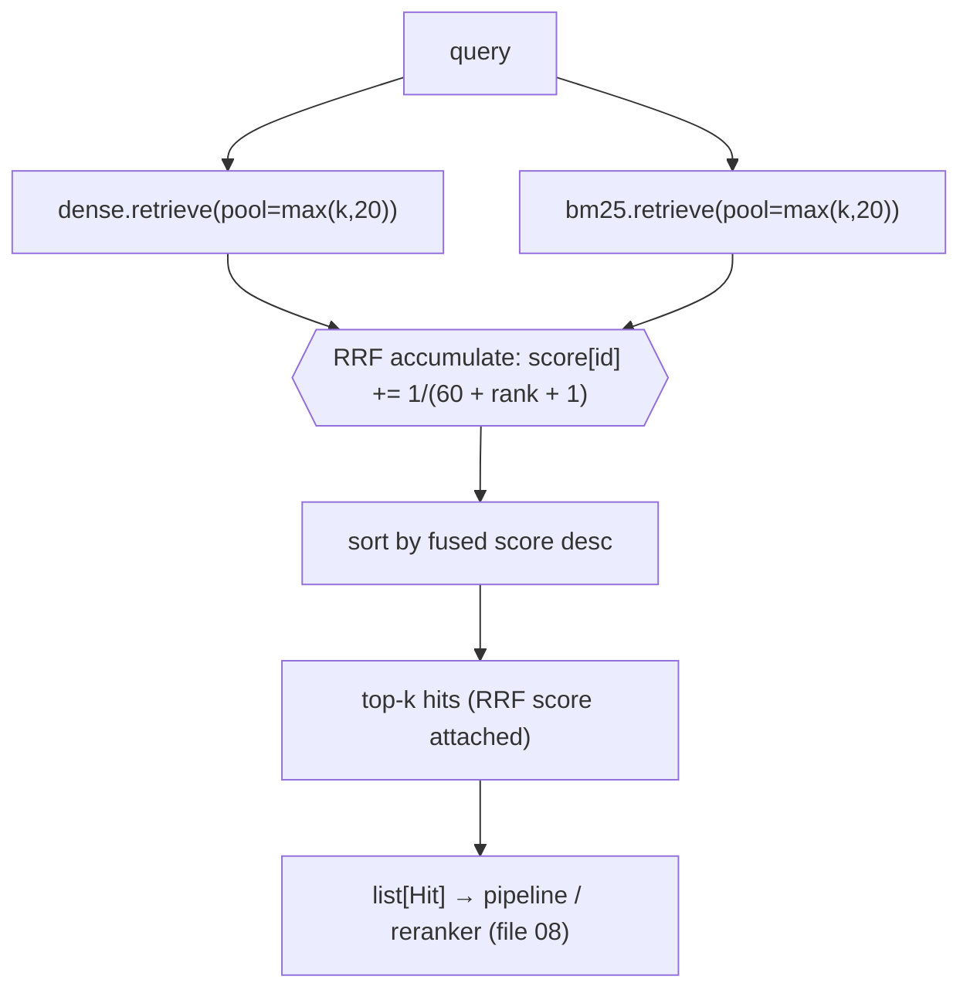

# 07 — Hybrid Retrieval: Fusing Dense + BM25 with Reciprocal Rank Fusion

*Subsystem: combining semantic and keyword results into one ranking. Code: `src/retrieval/hybrid.py`.*

---

## 1. The Claim

> *"Fused semantic (dense) and lexical (BM25) retrieval with Reciprocal Rank Fusion — a scale-free,
> tuning-free method that ranks by *position*, not raw score — so chunks strong in either signal
> surface and chunks strong in both win, capturing meaning and exact identifiers together."*

---

## 2. First Principles (from zero)

- **Hybrid retrieval** = run two (or more) retrievers and merge their results into one list. Here: dense
  (meaning, file 05) + BM25 (exact words, file 06). Their strengths are complementary, so the union
  beats either alone.
- **The fusion problem.** Dense scores are cosine similarities in [0, 1]; BM25 scores are unbounded
  (could be 0.4 or 40). Adding or averaging them is meaningless — you'd be comparing different units.
- **Reciprocal Rank Fusion (RRF)** = a merge that ignores raw scores and uses only each item's **rank**
  (position) in each list. Each list contributes `1 / (k + rank)` to an item's fused score. Items
  ranked highly in *either* list bubble up; items ranked highly in *both* win overall.
- **The constant `k` (default 60)** softens the gap between top ranks so rank #1 doesn't completely
  dominate rank #2 — a gentle smoothing, not a tuned hyperparameter.
- **Why rank, not score?** Rank is *scale-free* — position 1 means the same thing whether the underlying
  metric is cosine or BM25. That's what makes RRF combine incompatible scorers with no normalization
  and no training.

---

## 3. How It Actually Works Under the Hood

**Pull a pool from each retriever.** `HybridRetriever.retrieve(query, k)` asks *both* the dense and BM25
retrievers for a healthy pool (`max(k, 20)`) so fusion has enough material — you can't fuse well from
just the top-5 of each.

**Accumulate reciprocal-rank scores.** For each ranked list, it walks the hits in order and adds
`1 / (rrf_k + rank + 1)` to that chunk's fused score (the `+1` converts 0-based enumeration to 1-based
rank). A chunk appearing in *both* lists accumulates from both, so agreement between the two retrievers
is rewarded. It also stashes the hit object by id so it can return full hits, not just ids.

**Sort and return.** It sorts chunks by fused score descending, takes the top-k, attaches the RRF score
(for display), and returns them in the standard hit shape — so the pipeline treats hybrid exactly like
any other `Retriever`.

**Worked intuition.** Suppose chunk A is rank 1 in dense and rank 3 in BM25; chunk B is rank 2 in both.
A's fused score ≈ `1/61 + 1/63`; B's ≈ `1/62 + 1/62`. B's consistent presence in both can beat A's one
strong placement — RRF rewards *cross-retriever agreement*, which is usually the most trustworthy
signal. Meanwhile a chunk that only dense found (a pure paraphrase) or only BM25 found (an exact
identifier) still gets a real contribution and can make the top-k — so neither signal's unique wins are
lost.

---

## 4. Diagram

### ASCII — two ranked lists fused by position
```
  DENSE (by meaning)          BM25 (by keyword)          RRF: score = Σ 1/(k + rank)   (k=60)
  rank1: chunkA               rank1: chunkC
  rank2: chunkB               rank2: chunkB              chunkB: 1/(60+2) + 1/(60+2)  = 0.0323  ◄ in BOTH → wins
  rank3: chunkC               rank3: chunkA              chunkC: 1/(60+3) + 1/(60+1)  = 0.0323
  rank4: chunkD               rank4: chunkE              chunkA: 1/(60+1) + 1/(60+3)  = 0.0323
                                                         chunkD: 1/(60+4)             = 0.0156  (dense-only, still counts)
                                                         chunkE: 1/(60+4)             = 0.0156  (bm25-only, still counts)
                          → sort by fused score → top-k    (raw scores never compared)
```

### Mermaid — the fusion flow


---

## 5. How It Works in Code-Intel Engine (real code)

**RRF fusion (`src/retrieval/hybrid.py`):**
```python
class HybridRetriever(Retriever):
    def __init__(self, dense, bm25, rrf_k=60):
        self.dense, self.bm25, self.rrf_k = dense, bm25, rrf_k

    def retrieve(self, query, k):
        pool = max(k, 20)                                   # give fusion enough material
        dense_hits = self.dense.retrieve(query, pool)
        bm25_hits  = self.bm25.retrieve(query, pool)

        fused_score, by_id = {}, {}
        for ranked_list in (dense_hits, bm25_hits):
            for rank, hit in enumerate(ranked_list):
                cid = hit["chunk_id"]
                fused_score[cid] = fused_score.get(cid, 0.0) + 1.0 / (self.rrf_k + rank + 1)   # RANK, not score
                by_id[cid] = hit

        ordered = sorted(fused_score.items(), key=lambda kv: kv[1], reverse=True)[:k]
        return [{**by_id[cid], "score": round(score, 5)} for cid, score in ordered]
```

**Assembled by the factory (`src/rag/factory.py`):**
```python
bm25 = BM25Retriever(load_corpus(chunks_path))
return RagPipeline(HybridRetriever(dense, bm25), top_k=top_k)     # config == "hybrid"
```

---

## 6. Why I Chose This

- **Hybrid beats single-retriever** because dense and BM25 fail *differently* — dense misses exact
  tokens, BM25 misses paraphrases. Fusing them covers both, which is the whole point of retrieving
  meaning *and* identifiers in a codebase.
- **RRF over score-weighted fusion** because the two score scales are incompatible; RRF uses rank, so it
  needs **no normalization and no tuning/training** — it just works, and it's a well-respected standard.
- **A generous candidate pool (`max(k, 20)`)** so fusion sees enough of each list to find cross-retriever
  agreement rather than merging two tiny heads.
- **`k=60` as a sane default** — the community-standard smoothing constant; I didn't over-tune it because
  RRF is robust to it, and the eval harness would tell me if it mattered.
- **Same `Retriever` interface** so hybrid slots into the pipeline, the reranker, and evaluation
  unchanged.

---

## 7. Alternatives + Comparison Table

| Concern | Chosen | Alternative | Why NOT (here) |
|---|---|---|---|
| Combine signals | **Hybrid (dense + BM25)** | Dense only / BM25 only | Each has blind spots; the union covers meaning *and* exact tokens |
| Fusion method | **RRF (rank-based)** | Weighted sum of normalized scores | Requires per-corpus normalization + weight tuning; brittle. RRF is scale-free and tuning-free |
| Fusion method | **RRF** | Learned fusion (train a ranker) | Needs labeled data + training; overkill, and RRF is strong out of the box |
| Fusion method | **RRF** | Just concatenate + dedup | Loses the "agreement" signal; RRF rewards chunks strong in both lists |
| Pool size | **max(k, 20) per list** | Fuse only top-k of each | Too little material; misses items ranked just outside each head |
| `k` constant | **60 (default)** | Aggressively tuned k | RRF is robust to k; tuning it is low-ROI vs the eval budget |

---

## 8. Scenarios & Edge Cases

1. **Chunk strong in both lists.** Accumulates from dense *and* BM25 → usually wins the top spot
   (agreement is the most trustworthy signal).
2. **Pure-paraphrase question.** Dense ranks the right chunk high, BM25 doesn't — RRF still gives it
   dense's contribution, so it survives into top-k.
3. **Exact-identifier question.** BM25 ranks it high, dense doesn't — RRF keeps it via BM25's
   contribution. Neither unique win is lost.
4. **A chunk only one retriever found.** Still gets a real (smaller) score and can make the cut — fusion
   doesn't require presence in both lists.
5. **Both lists disagree completely.** RRF produces a blended ranking; the reranker (file 08) then
   sharpens the final order with a precise cross-encoder pass.
6. **Tie in fused score.** Python's stable sort keeps a deterministic order; ties are broken
   consistently, and reranking reorders anyway.

---

## 9. How I Verified It

- **The measurable payoff:** `evaluate.py dense` vs `evaluate.py hybrid` on the golden set — hybrid
  should match or beat dense on *context recall*, especially for identifier/keyword questions, since it
  can retrieve exact-token chunks dense under-ranks (file 12).
- **Fused scores are inspectable:** each hybrid hit carries its RRF score, so I can see chunks present in
  both lists ranking above single-list chunks.
- **Determinism:** the same query yields the same fused ranking (pure function of the two input lists),
  so results are reproducible run-to-run.

---

## 10. Interview Q&A (easy → hard)

**Q (easy). What is hybrid retrieval?** "Running both semantic and keyword retrieval and merging their
results, so I catch meaning *and* exact identifiers — because the two methods miss different things."

**Q (easy). Why can't you just add the two scores?** "They're on different scales — cosine is 0 to 1,
BM25 is unbounded. Adding them compares apples to oranges. So I fuse on *rank* instead of raw score."

**Q (medium). Explain RRF.** "Reciprocal Rank Fusion ignores raw scores and uses each item's position
in each list. Each list adds `1/(k + rank)` to an item's fused score. Items ranked highly in either list
rise; items ranked highly in both win. It's scale-free, needs no tuning, and is a well-known technique."

**Q (medium). What does the constant k do?** "It softens the difference between top ranks so rank 1
doesn't completely dominate rank 2. Default 60. RRF is robust to it, so I use the standard value rather
than over-tuning."

**Q (medium). Why pull a pool of 20 from each, not just top-k?** "So fusion has enough material to find
cross-retriever agreement. If I only fused the top-5 of each, I'd miss chunks ranked just outside each
head that RRF would otherwise surface."

**Q (hard). Why RRF over a weighted score fusion or a learned ranker?** "Weighted fusion needs
per-corpus normalization and weight tuning — brittle and fiddly. A learned ranker needs labeled training
data. RRF gives most of the benefit with none of that: it's scale-free, parameter-light, deterministic,
and a respected baseline. I can always upgrade to learned fusion if the eval numbers justified it."

**Q (hard). Does RRF ever lose a good result that only one retriever found?** "No — a chunk in only one
list still gets that list's `1/(k+rank)` contribution and can make the top-k. RRF *rewards* agreement
but doesn't *require* it, so unique wins from either dense or BM25 are preserved."

**Q (curveball). If hybrid is better, why keep a dense-only config?** "For measurement and simplicity.
The dense config is the baseline the eval harness compares against to *prove* hybrid helps, and it's a
lighter path for simple queries. Keeping all configs is what makes each upgrade defensible (file 12)."

---

## 11. Traps to Avoid

- ❌ Don't add/average dense and BM25 scores — different scales; RRF fuses by rank.
- ❌ Don't say RRF needs tuning/training — it's scale-free and parameter-light.
- ❌ Don't fuse only the top-k of each — pull a pool so fusion has material.
- ❌ Don't claim RRF drops single-list results — they still contribute and can rank in.
- ❌ Don't oversell k=60 as tuned — it's the robust default.

---

⬅️ Prev: [`06-bm25-keyword-retrieval.md`](06-bm25-keyword-retrieval.md) ·
➡️ Next: [`08-reranking-cross-encoder.md`](08-reranking-cross-encoder.md) ·
🔗 Related: [`05-dense-retrieval.md`](05-dense-retrieval.md), [`12-evaluation-and-judge.md`](12-evaluation-and-judge.md)
