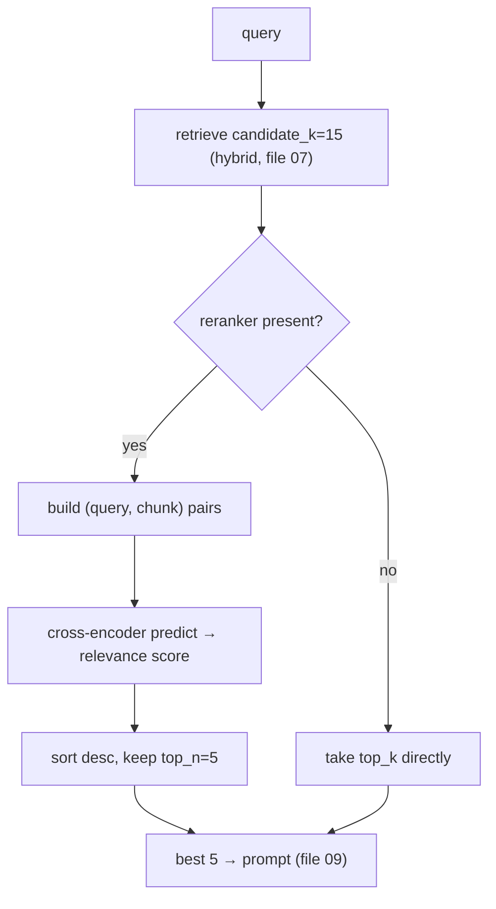

# 08 — Reranking: Two-Stage Retrieval with a Cross-Encoder

*Subsystem: a sharp, second-pass filter that reorders retrieved candidates by true relevance. Code:
`src/retrieval/rerank.py`, wired in `src/rag/pipeline.py` + `src/rag/factory.py`.*

---

## 1. The Claim

> *"Added a two-stage retrieval design: a fast bi-encoder/BM25 first stage narrows the corpus to ~15
> candidates, then a cross-encoder reranker reads each (query, chunk) pair *together* to reorder them
> to the best top-5 — precision where it matters without paying its cost over the whole corpus."*

---

## 2. First Principles (from zero)

- **Bi-encoder (what retrieval uses).** Encodes the query and each chunk **separately** into vectors,
  then compares by distance. Fast and scalable (you pre-embed all chunks once), but a bit *blurry* — the
  model never sees the query and chunk together, so it can't reason about their specific interaction.
- **Cross-encoder (what reranking uses).** Feeds the query and one chunk into the model **together** and
  outputs a single relevance score for that pair. Far more accurate — it can weigh exactly how the chunk
  answers *this* query — but **slow**, because you must run the model once per candidate (no
  pre-computation possible).
- **Two-stage retrieval (retrieve-then-rerank).** The standard production pattern: use the fast method
  to narrow millions → a handful of candidates, then the slow, accurate method to reorder just those.
  You get precision where it matters without paying its cost everywhere.
- **`candidate_k` vs `top_k`.** Retrieve *more* candidates than you'll keep (`candidate_k`, e.g. 15) so
  the reranker has a real pool to choose from, then keep the best `top_k` (e.g. 5) it selects.
- **Why precision matters for RAG.** The LLM only sees the final top-k. If a mediocre chunk sits in the
  top-5 and the great one is at rank 8, the answer suffers. Reranking's job is to make sure the truly
  best chunks are the ones handed to the model.

---

## 3. How It Actually Works Under the Hood

**Score pairs, not vectors.** `CrossEncoderReranker.rerank(query, hits, top_n)` builds `(query,
chunk_content)` pairs for every candidate and calls `model.predict(pairs)`. The cross-encoder
(`ms-marco-MiniLM-L-6-v2`, trained specifically for relevance ranking) returns one score per pair
reflecting how well that chunk answers *this* query — a judgment a bi-encoder can't make because it
scored them separately.

**Reorder and trim.** It zips hits with their scores, sorts descending, keeps `top_n`, and writes both
`rerank_score` and a unified `score` onto each hit (so display stays consistent). Empty input returns
empty — no crash.

**Where it sits in the pipeline.** When a reranker is present, `RagPipeline` raises `candidate_k` (the
factory sets 15 for `hybrid_rerank`) so retrieval hands the reranker a bigger pool, then the reranker
narrows to `top_k=5`. Without a reranker, the pipeline just takes the top_k directly. So reranking is an
*optional, composable* precision stage — the same pipeline supports dense, hybrid, and hybrid+rerank.

**The cost trade-off, made explicit.** Running a cross-encoder over the whole corpus would be
prohibitively slow (one forward pass per chunk). Running it over only ~15 candidates is cheap and adds
just a little latency — which is exactly why the fast first stage exists: to make the slow, accurate
stage affordable.

---

## 4. Diagram

### ASCII — fast-then-sharp
```
  STAGE 1 (fast, blurry)                     STAGE 2 (slow, sharp)
  hybrid retrieve candidate_k=15             cross-encoder reads (query, chunk) TOGETHER
  ┌───────────────────────────┐              ┌────────────────────────────────────────┐
  │ millions of chunks         │             │ score each of the 15 pairs             │
  │   → HNSW + BM25 + RRF       │──15 cands──►│   model.predict([(q,c1),(q,c2),...])   │
  │   (each scored SEPARATELY)  │             │ sort desc → keep top_n = 5             │
  └───────────────────────────┘              └───────────────┬────────────────────────┘
        cheap over everything                                ▼
                                                  best 5 chunks → LLM (file 09)
     (running stage 2 over ALL chunks would be far too slow → that's why stage 1 exists)
```

### Mermaid — optional rerank stage in the pipeline


---

## 5. How It Works in Code-Intel Engine (real code)

**Cross-encoder rerank (`src/retrieval/rerank.py`):**
```python
DEFAULT_MODEL = "cross-encoder/ms-marco-MiniLM-L-6-v2"   # small, fast, relevance-trained

class CrossEncoderReranker:
    def __init__(self, model_name=DEFAULT_MODEL):
        self.model = CrossEncoder(model_name)

    def rerank(self, query, hits, top_n):
        if not hits: return []
        pairs = [(query, h["content"]) for h in hits]     # query + chunk read TOGETHER
        scores = self.model.predict(pairs)
        ranked = sorted(zip(hits, scores), key=lambda p: p[1], reverse=True)[:top_n]
        return [{**h, "rerank_score": float(s), "score": float(s)} for h, s in ranked]
```

**Pipeline retrieves a bigger pool when reranking (`src/rag/pipeline.py`):**
```python
self.candidate_k = candidate_k if reranker else top_k     # more candidates if we'll rerank
def retrieve(self, question):
    hits = self.retriever.retrieve(question, k=self.candidate_k)
    return self.reranker.rerank(question, hits, top_n=self.top_k) if self.reranker else hits[:self.top_k]
```

**Factory wires the strongest config (`src/rag/factory.py`):**
```python
# config == "hybrid_rerank"
return RagPipeline(hybrid, reranker=CrossEncoderReranker(), top_k=top_k, candidate_k=15)
```

---

## 6. Why I Chose This

- **Two-stage retrieval is the standard for a reason:** it puts precision exactly where the LLM sees it
  (the final top-k) while keeping the corpus-wide pass cheap. It's how strong production search is built.
- **A cross-encoder** because reading query+chunk together is genuinely more accurate than comparing
  separately-made vectors — it fixes the "blurry" ordering of the first stage.
- **Run it on ~15 candidates, not the corpus**, because that's what makes an otherwise-slow model
  affordable; the fast first stage exists precisely to enable this.
- **A local, small cross-encoder** (`ms-marco-MiniLM`) so reranking is free and private — no Cohere
  Rerank API bill or data egress.
- **Optional and composable** (reranker=None by default) so simple queries skip the latency and the eval
  harness can measure the rerank uplift in isolation.

---

## 7. Alternatives + Comparison Table

| Concern | Chosen | Alternative | Why NOT (here) |
|---|---|---|---|
| Precision pass | **Cross-encoder rerank on top candidates** | Trust first-stage ranking | Bi-encoder order is blurry; the LLM only sees top-k, so precision there matters most |
| Rerank scope | **~15 candidates** | Cross-encode the whole corpus | One forward pass per chunk — far too slow at scale |
| Reranker | **Local `ms-marco-MiniLM`** | Cohere Rerank API | Paid + sends data out; local is free, private, deterministic |
| Reranker | **Cross-encoder** | LLM-as-reranker (ask GPT to rank) | Much slower + costlier per query; a small cross-encoder is purpose-built and fast |
| When to run | **Optional stage (config)** | Always rerank | Adds latency simple queries don't need; keeping it optional enables A/B measurement |
| Model size | **MiniLM (small)** | Large cross-encoder | Marginal accuracy gain for more latency on the hot path; small is the right point |

---

## 8. Scenarios & Edge Cases

1. **The great chunk is at rank 8 after retrieval.** The cross-encoder scores it highest on the
   (query, chunk) pair and promotes it into the top-5 the LLM sees — the core win.
2. **A lexically-similar-but-irrelevant chunk** slipped into the candidate pool. The cross-encoder
   recognizes it doesn't actually answer the query and demotes it.
3. **Empty candidate list.** `rerank` returns `[]` immediately — no crash, pipeline handles the empty
   answer.
4. **candidate_k too small.** If retrieval returns only 5, the reranker can only reorder those 5 — which
   is why `hybrid_rerank` sets candidate_k=15 to give it room.
5. **Latency-sensitive simple query.** Use the `hybrid` (no rerank) config — same pipeline, one stage,
   faster.
6. **First run.** The cross-encoder model downloads once and caches (like the embedder), then reused;
   the Streamlit app caches the whole pipeline so it loads once per process (file 13).

---

## 9. How I Verified It

- **The uplift is measurable:** `evaluate.py hybrid` vs `evaluate.py hybrid_rerank` on the golden set —
  reranking should improve ordering-sensitive metrics (correctness/faithfulness) by putting the best
  chunks in front of the LLM (file 12).
- **Scores are inspectable:** each reranked hit carries a `rerank_score`, so I can confirm the reordering
  differs from (and improves on) the fused order.
- **The two-stage cost model is real:** reranking only touches `candidate_k≈15` items, so the added
  latency is small and bounded — observable in how quickly `ask_agent.py`/the app respond.

---

## 10. Interview Q&A (easy → hard)

**Q (easy). What is reranking?** "A second pass that reorders the retrieved candidates by true relevance
using a more accurate model, then keeps the best few for the LLM."

**Q (easy). Bi-encoder vs cross-encoder?** "A bi-encoder embeds the query and each chunk separately and
compares vectors — fast and scalable but blurry. A cross-encoder reads the query and chunk together and
scores that pair — much more accurate but slow, so you only run it on a few candidates."

**Q (medium). Why two-stage retrieval?** "To get precision where it matters without paying its cost
everywhere. The fast first stage narrows the corpus to ~15 candidates; the slow, sharp cross-encoder
reorders just those into the top-5. Running the cross-encoder over the whole corpus would be far too
slow."

**Q (medium). Why does the pipeline raise candidate_k when reranking?** "So the reranker has a real pool
to choose from. If I only retrieved 5, it could only reorder those 5. `hybrid_rerank` retrieves 15
candidates and the reranker picks the best 5."

**Q (medium). Why does precision at top-k matter so much?** "Because the LLM only sees the final top-k
chunks. If a mediocre chunk is in the top-5 and the perfect one is at rank 8, the answer degrades.
Reranking makes sure the best chunks are the ones the model actually reads."

**Q (hard). Why a cross-encoder and not just ask an LLM to rank?** "An LLM reranker works but is much
slower and costlier per query and less deterministic. A small cross-encoder like MiniLM is purpose-built
for relevance ranking, runs locally for free, and is fast enough on ~15 candidates. It's the right tool
for the precision stage."

**Q (hard). Where's the latency, and how do you bound it?** "The cross-encoder runs one forward pass per
candidate, so cost is linear in candidate_k. I bound it by keeping candidate_k small (~15) and making
reranking optional — simple queries use the no-rerank config. The heavy model loads once and is cached."

**Q (curveball). Could you skip retrieval and just cross-encode everything?** "No — that's the anti-
pattern. Cross-encoding every chunk is O(N) forward passes, which is exactly the cost the fast first
stage exists to avoid. Two-stage is what makes the accurate model affordable."

---

## 11. Traps to Avoid

- ❌ Don't confuse bi-encoder (separate, fast) with cross-encoder (together, slow, accurate).
- ❌ Don't say you rerank the whole corpus — you rerank ~15 candidates.
- ❌ Don't forget candidate_k must exceed top_k or the reranker has nothing to choose from.
- ❌ Don't call reranking mandatory — it's an optional precision stage measured against the baseline.
- ❌ Don't propose an LLM reranker as obviously better — it's slower/costlier; a cross-encoder is purpose-built.

---

⬅️ Prev: [`07-hybrid-retrieval-rrf.md`](07-hybrid-retrieval-rrf.md) ·
➡️ Next: [`09-generation-and-citations.md`](09-generation-and-citations.md) ·
🔗 Related: [`F1-vectors-embeddings-similarity.md`](F1-vectors-embeddings-similarity.md), [`12-evaluation-and-judge.md`](12-evaluation-and-judge.md)
