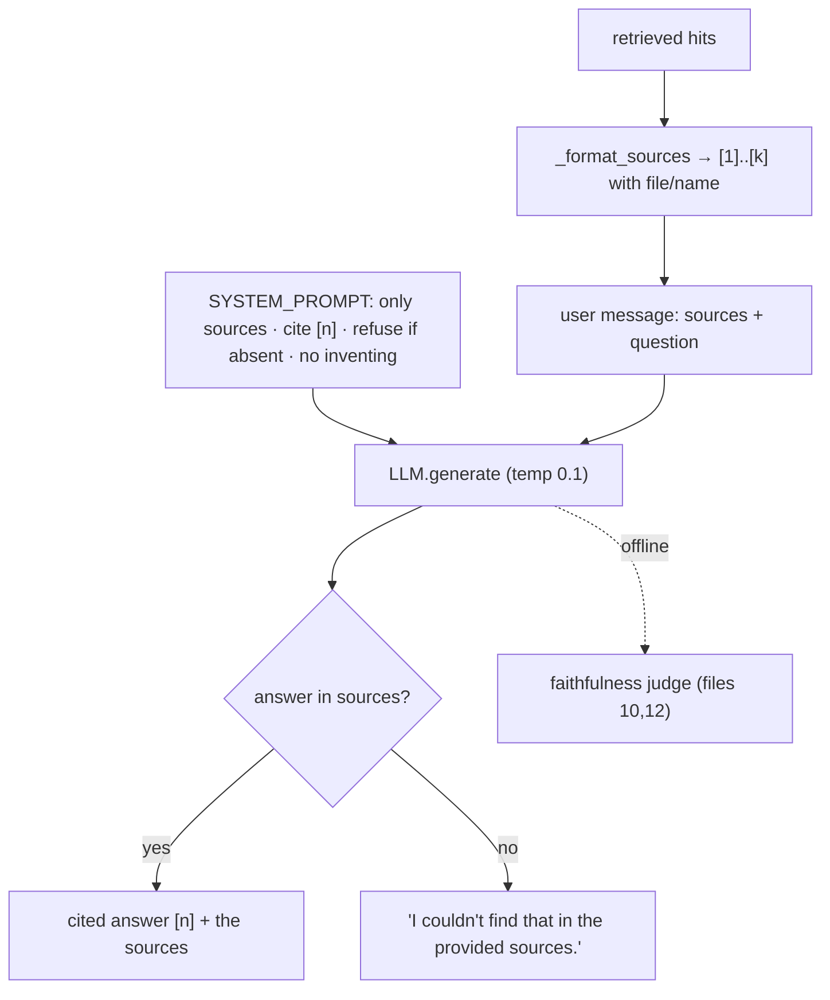

# 09 — Generation & Citations: Grounded Answers That Fight Hallucination

*Subsystem: turning retrieved chunks into a cited, grounded answer. Code: `src/rag/pipeline.py`
(`SYSTEM_PROMPT`, `_format_sources`, `answer`), `ask.py`.*

---

## 1. The Claim

> *"Generated answers grounded strictly in the retrieved sources: a numbered-source prompt, a system
> instruction to use ONLY those sources, cite every claim with `[n]`, and emit a fixed refusal when the
> answer isn't present — with low temperature to keep it faithful and repeatable."*

---

## 2. First Principles (from zero)

- **Generation** = the "G" in RAG: the LLM writes the final answer. But an LLM predicts *plausible*
  text, so left alone it will confidently fill gaps — **hallucinate** (F2). Generation design is really
  *hallucination control*.
- **Grounding** = forcing the answer to come from provided source text rather than the model's memory.
  The lever: put the retrieved chunks in the prompt and instruct "use ONLY these."
- **Augmentation** = the "A" in RAG: building the prompt from the retrieved chunks — here, formatting
  them as a **numbered source list** so the model can cite by number.
- **Citation** = an inline `[n]` marker tying a claim to source #n. It forces attribution (every claim
  must point at a source) and lets the user verify.
- **Safe refusal** = a fixed sentence the model must output when the sources don't contain the answer —
  so "I don't know" is a *designed* outcome, not a guess.
- **Temperature** = randomness knob; low (0.1) keeps the answer focused and repeatable (F2).

---

## 3. How It Actually Works Under the Hood

**Augment: format chunks as numbered sources.** `_format_sources(hits)` renders each chunk as
`[i] file: <path> (<name>)` followed by its content. The `[i]` numbering is what makes citation
possible — the model can write `[1]` and the reader knows exactly which chunk/file it refers to. The
file/name header gives the model (and user) provenance.

**Instruct: a strict system prompt.** The `SYSTEM_PROMPT` sets four hard rules: (1) answer using **ONLY**
the numbered sources, no outside knowledge; (2) **cite every claim** with `[n]`; (3) if the sources
don't contain the answer, reply **exactly** "I couldn't find that in the provided sources."; (4) be
concise/technical and never invent files or behavior. This is the entire anti-hallucination contract,
expressed in the system role so it governs the whole turn (F2).

**Generate: low-temperature call.** `answer()` builds the user message
(`Sources:\n<numbered>\n\nQuestion: <q>`), sends it with the system prompt to the LLM at temperature 0.1
(file 11), and returns `(answer, hits)` — the answer *plus* the exact sources it was grounded in, so the
UI/CLI can show them.

**Fail safe on empty retrieval.** If no chunks come back, `answer()` returns "The index is empty — run
build_index.py first." instead of asking the model to invent something.

**Why this actually reduces hallucination (and its limits).** Grounding + "only the sources" + citations
+ a refusal path + low temperature together make ungrounded claims both *discouraged* and *visible* (an
uncited sentence stands out). It's not a guarantee — an LLM can still slip — which is precisely why the
agent adds an LLM faithfulness *judge* (file 10) and the eval harness *measures* faithfulness (file 12).
Prompting is the cheap first line; verification is the backstop.

---

## 4. Diagram

### ASCII — retrieved chunks → grounded, cited answer
```
  top-k hits (files 05-08)
     │  _format_sources
     ▼
  [1] file: bank.py (Account.deposit)     ┐
      def deposit(self, amount): ...        │  numbered sources = citation handles
  [2] file: bank.py (Account.withdraw)      │
      if amount > self.balance: raise ...    ┘
     │
     ▼  SYSTEM_PROMPT (ONLY these sources · cite [n] · refuse if absent · don't invent)
        + user: "Sources: [1..k]\n\nQuestion: ..."     temperature 0.1
     ▼
  LLM  →  "deposit() adds to balance [1]; withdraw() raises on insufficient funds [2]."
          OR  "I couldn't find that in the provided sources."   (safe refusal)
     │
     ▼  returned WITH its sources → shown to the user (verify each [n])
```

### Mermaid — the generation contract


---

## 5. How It Works in Code-Intel Engine (real code)

**The grounding contract (`src/rag/pipeline.py`):**
```python
SYSTEM_PROMPT = """You are a precise codebase and documentation assistant.
Rules:
- Answer using ONLY the numbered sources provided. Do not use outside knowledge.
- Cite every claim with its source number in square brackets, e.g. [1], [2].
- If the sources do not contain the answer, reply exactly: "I couldn't find that in the provided sources."
- Be concise and technical. Never invent files, functions, or behavior that isn't in the sources."""
```

**Numbered sources + the answer call (`src/rag/pipeline.py`):**
```python
def _format_sources(hits):
    blocks = []
    for i, hit in enumerate(hits, 1):                       # 1-based → citation numbers
        meta = hit["metadata"]
        name = meta.get("name") or meta.get("heading") or meta.get("kind", "")
        header = f"[{i}] file: {meta.get('file','?')}" + (f"  ({name})" if name else "")
        blocks.append(f"{header}\n{hit['content']}")
    return "\n\n".join(blocks)

def answer(self, question):
    hits = self.retrieve(question)
    if not hits:
        return "The index is empty — run build_index.py first.", []
    user = f"Sources:\n{_format_sources(hits)}\n\nQuestion: {question}"
    return self.llm.generate(SYSTEM_PROMPT, user), hits     # answer + the sources it used
```

**Answer shown WITH its sources (`ask.py`):**
```python
answer, hits = pipeline.answer(question)
print(answer)
for i, hit in enumerate(hits, 1):
    print(f"  [{i}] {hit['chunk_id']}   (score {round(hit.get('score',0.0),3)})")   # verifiable provenance
```

---

## 6. Why I Chose This

- **Prompt-level grounding + citations** is the cheapest, most transparent way to fight hallucination:
  the answer must come from the sources, and every claim must point at one — so ungrounded text is both
  discouraged and visible.
- **A fixed refusal string** makes "I don't know" a *designed, testable* outcome (the golden set asserts
  it, file 12) instead of leaving the model to improvise — improvising is where hallucination lives.
- **Numbered sources** give the model concrete citation handles and give the user provenance to verify.
- **Return the sources with the answer** so the UI/CLI always shows what grounded each claim — trust is
  built by letting the user check.
- **Low temperature (0.1)** so a code assistant is faithful and repeatable, not creative.
- **Prompting, not fine-tuning**, because the answer already lives in the retrieved text — fine-tuning
  for grounding would be expensive overkill.

---

## 7. Alternatives + Comparison Table

| Concern | Chosen | Alternative | Why NOT (here) |
|---|---|---|---|
| Grounding | **"Use ONLY the sources" prompt** | Let the model use its own knowledge | It doesn't know *this* repo and would hallucinate; sources are ground truth |
| Grounding method | **Prompt + citations** | Fine-tune for grounding | Expensive, slow to iterate; unnecessary when context holds the answer |
| Unknown answers | **Fixed refusal string** | Let the model improvise | Improvising = hallucination; a fixed refusal is safe and testable |
| Attribution | **Inline `[n]` citations** | No citations | Users can't verify; uncited claims hide hallucinations |
| Attribution | **`[n]` in the prompt** | Post-hoc citation matching | Forcing the model to cite as it writes is simpler and more reliable |
| Determinism | **temperature 0.1** | default (~0.7) | Creativity causes drift in a factual assistant |
| Context budget | **top-k after rerank** | Stuff all retrieved chunks | Overflows the window, dilutes attention, costs more (F2) |

---

## 8. Scenarios & Edge Cases

1. **Answer is in the sources.** The model composes it and cites `[1][2]`; the CLI/UI lists those exact
   chunks for verification.
2. **Answer is NOT in the sources.** The rules force "I couldn't find that in the provided sources." —
   verified by the golden set's unanswerable question (file 12).
3. **Model tries outside knowledge.** An uncited claim (no `[n]`) is conspicuous and scores low with the
   faithfulness judge (files 10, 12).
4. **Empty retrieval.** `answer()` short-circuits with the "index is empty" message — no hallucinated
   answer from nothing.
5. **Too many/long chunks.** Retrieval keeps a small top-k and reranking puts the best first, so the
   prompt stays within the window and the key source isn't diluted (files 07–08).
6. **Multi-part question.** One retrieval may under-cover it → the agent decomposes it first, then this
   same generation contract answers with the pooled sources (file 10).

---

## 9. How I Verified It

- **Faithfulness is measured, not assumed:** the eval harness scores it via the LLM judge, normalized
  0–1, per config (file 12); the agent uses the same judge to decide whether to retry (file 10).
- **The refusal path is unit-checked** by the golden set's `q6_unanswerable` case (`answer_must_include:
  ["couldn't find"]`).
- **Citations are visible end-to-end:** `ask.py` and the Streamlit UI print/expand the exact sources per
  answer, so any ungrounded claim is easy to spot by eye.
- **Answer correctness** is checked by asserting the answer contains expected key facts on the golden set
  (file 12).

---

## 10. Interview Q&A (easy → hard)

**Q (easy). How does your system avoid making things up?** "It only answers from the retrieved sources,
must cite every claim with `[n]`, and outputs a fixed 'I couldn't find that' if the answer isn't there —
all at low temperature. Then I *measure* faithfulness with an LLM judge, so grounding isn't just hoped
for."

**Q (easy). Why number the sources?** "So the model can cite by number and the user can trace each claim
to a specific chunk and file. The numbering is what makes `[n]` citations meaningful."

**Q (medium). What exactly is in your system prompt and why?** "Four rules: use only the numbered
sources, cite every claim, refuse with a fixed sentence if the answer's absent, and never invent
files/behavior. Together they make ungrounded text both discouraged and visible, which is the core
anti-hallucination design."

**Q (medium). Why return the sources with the answer?** "Trust. Showing the exact chunks each answer was
grounded in lets the user verify — and makes an uncited or wrong claim obvious. It also feeds the
faithfulness judge and evaluation."

**Q (medium). Why temperature 0.1 for generation?** "A code assistant must be faithful and repeatable.
Low temperature makes the model pick high-probability tokens, so the same question and sources give a
stable grounded answer rather than a creative one."

**Q (hard). Prompting can't guarantee grounding — so what?** "Correct — that's why grounding is layered.
Prompting + citations is the cheap first line; the agent adds an LLM faithfulness judge that can trigger
a retry (file 10); and the eval harness measures faithfulness so regressions are caught (file 12).
Defense in depth, and honest about the prompt's limits."

**Q (hard). Why prompt-level grounding instead of fine-tuning?** "The answer already lives in the
retrieved text, so I don't need to change the model's weights — I need it to *use* the context and cite
it. Fine-tuning is expensive, slow to iterate, and still wouldn't know today's repo. Prompting is
transparent and sufficient; I'd fine-tune only for a fixed output format if needed."

**Q (curveball). What if a source is wrong or outdated?** "Then the answer reflects the source and cites
it — which is correct behavior for a repo assistant: the repo is ground truth, and the citation makes
the basis explicit so a human can catch a bad source. Fixing wrong sources is a data problem, not a
generation one."

---

## 11. Traps to Avoid

- ❌ Don't claim the prompt *guarantees* no hallucination — it reduces it; the judge/eval measure it.
- ❌ Don't forget the fixed refusal — it's a designed, testable outcome, not the model improvising.
- ❌ Don't drop the sources from the response — provenance is how trust is built.
- ❌ Don't use a high temperature for a factual assistant.
- ❌ Don't say "just add more context" — top-k + rerank keep the prompt focused and within the window.

---

⬅️ Prev: [`08-reranking-cross-encoder.md`](08-reranking-cross-encoder.md) ·
➡️ Next: [`10-agentic-loop.md`](10-agentic-loop.md) ·
🔗 Related: [`F2-llms-tokens-prompting.md`](F2-llms-tokens-prompting.md), [`12-evaluation-and-judge.md`](12-evaluation-and-judge.md)
