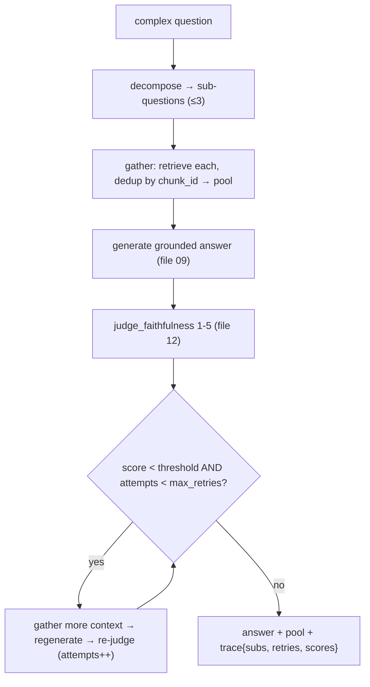

# 10 — The Agentic Loop: Decompose → Gather → Generate → Self-Critique → Retry

*Subsystem: the system that plans a complex question, gathers context for each part, answers, and
checks itself. Code: `src/agent/agent.py`, `ask_agent.py`.*

---

## 1. The Claim

> *"Built an agentic RAG loop that decomposes a multi-part question into sub-questions, retrieves and
> pools unique context for each, generates an answer, then runs an LLM self-critic that scores
> faithfulness and retries with more context if it's low — with a hard retry cap so it can never loop
> forever."*

---

## 2. First Principles (from zero)

- **Plain RAG = one retrieve → one answer.** That struggles with (a) *multi-part* questions ("how does
  auth work AND how are passwords stored?") — a single search can't cover both well — and (b) *silent
  hallucination* — nothing verifies the answer is actually grounded.
- **Agentic = the program makes its own decisions** about *how* to solve the task (how to split the
  question, whether the answer is good enough, whether to try again) instead of following one fixed
  path. It's control flow driven by the model's judgments.
- **Query decomposition** = using an LLM to break a complex question into 2–3 focused sub-questions,
  each of which retrieves better than the tangled original.
- **Self-critique (reflection)** = the system grades its own output — here, an LLM **faithfulness judge**
  scores 1–5 whether every claim is supported by the sources (file 12).
- **Retry with a cap** = if the critique fails, gather more context and regenerate — but only up to a
  fixed number of times, so the loop is guaranteed to terminate (no runaway cost/latency).
- **Deduplication** = when gathering context for several sub-questions, keep each chunk once (by
  `chunk_id`) so the prompt isn't padded with repeats.

---

## 3. How It Actually Works Under the Hood

**Step 1 — Decompose.** `_decompose(question)` asks an LLM (with `_DECOMPOSE_SYSTEM`) to output 2–3
focused sub-questions, one per line — or the question unchanged if it's already single-focus. It strips
bullet characters, and has two safety nets: never return nothing (fall back to the original question),
and cap at 3 sub-questions to bound cost.

**Step 2 — Gather unique context.** `_gather(questions, seen, pool)` retrieves for *each* sub-question
via the underlying pipeline (which is `hybrid_rerank` by default, files 07–08) and adds only chunks
whose `chunk_id` isn't already `seen`. So the pool is the *union* of the best chunks across all
sub-questions, deduplicated — broader coverage than one search could give.

**Step 3 — Generate, critique, retry (capped).** It generates an answer from the pooled sources (same
grounded prompt as file 09), then scores it with `judge_faithfulness` (1–5, file 12). While the score is
below `faithful_threshold` (4) **and** attempts are under `max_retries` (1 by default), it gathers *more*
context (retrieving for the original question) and regenerates, re-scoring each time. The `while`
condition's two clauses guarantee termination: even a persistently-unfaithful answer stops after the cap.

**A trace for transparency.** It returns `(answer, pool, trace)` where `trace` records the
`sub_questions`, the number of `retries`, and the list of `faithfulness_scores` — so `ask_agent.py` and
the UI can *show* how the agent reasoned (what it split into, whether it retried, and how the
faithfulness moved). That observability is what makes the "agentic" behavior defensible rather than
magic.

**Why the cap is non-negotiable.** Self-correcting loops are the classic way to accidentally build an
infinite (and expensive) loop. A hard `max_retries` converts "retry until good" into "retry at most N",
trading a little potential quality for a guaranteed, bounded cost.

---

## 4. Diagram

### ASCII — the four moves with a bounded retry
```
  QUESTION: "how do I add money, and what stops over-withdrawing?"
     │ 1. DECOMPOSE (LLM)
     ▼
  ["how do I add money?", "what prevents withdrawing more than balance?"]   (≤3, else original)
     │ 2. GATHER (retrieve each · dedup by chunk_id)
     ▼
  pool = unique union of best chunks (hybrid_rerank)
     │ 3. GENERATE (grounded prompt, file 09)
     ▼
  answer ── judge_faithfulness → score/5 (file 12)
     │
     ├─ score ≥ 4  → done ✅
     └─ score < 4 AND attempts < max_retries → GATHER more (original q) → REGENERATE → re-judge
                                              (attempts++ ; hard cap → always terminates)
     ▼
  (answer, pool, trace{sub_questions, retries, faithfulness_scores})
```

### Mermaid — the loop with the terminating guard


---

## 5. How It Works in Code-Intel Engine (real code)

**Decompose with safety nets (`src/agent/agent.py`):**
```python
def _decompose(self, question):
    raw = self.llm.generate(_DECOMPOSE_SYSTEM, question)
    subs = [line.strip("-• ").strip() for line in raw.splitlines() if line.strip()]
    return subs[:3] if subs else [question]        # never empty; cap at 3 to control cost
```

**Gather unique context across sub-questions:**
```python
def _gather(self, questions, seen, pool):
    for q in questions:
        for hit in self.pipeline.retrieve(q):      # hybrid_rerank under the hood
            if hit["chunk_id"] not in seen:
                seen.add(hit["chunk_id"]); pool.append(hit)   # dedup by id
```

**Generate + self-critique + capped retry (orchestration):**
```python
answer = self._generate(question, pool)
scores = [judge_faithfulness(question, answer, pool)]        # 1-5
attempts = 0
while attempts < self.max_retries and scores[-1] < self.faithful_threshold:
    self._gather([question], seen, pool)                     # fetch MORE context
    answer = self._generate(question, pool)
    scores.append(judge_faithfulness(question, answer, pool))
    attempts += 1                                            # hard cap → always terminates
trace = {"sub_questions": sub_questions, "retries": attempts, "faithfulness_scores": scores}
return answer, pool, trace
```

---

## 6. Why I Chose This

- **Decomposition** because multi-part questions retrieve poorly as one blob; focused sub-questions each
  pull their own relevant chunks, and the union covers the whole question.
- **Deduplicated pooling** so combining sub-question results doesn't waste the context budget on repeats.
- **LLM self-critique on faithfulness** because "is this actually supported?" is semantic — perfect for
  an LLM judge and a natural retry trigger; it turns hallucination from silent to *caught*.
- **A hard retry cap** because unbounded self-correction is how you build an infinite, expensive loop; a
  cap guarantees termination and bounded cost.
- **Hand-written (~90 lines), not a framework** because I wanted to own and explain the control flow;
  LangGraph/LangChain-Agents would hide exactly the logic an interviewer wants me to defend.
- **A returned trace** so the agent's decisions are observable (and demoable in the UI), not a black box.

---

## 7. Alternatives + Comparison Table

| Concern | Chosen | Alternative | Why NOT (here) |
|---|---|---|---|
| Agent framework | **Hand-written loop** | LangChain Agents / LangGraph | Hide the control flow, add heavy deps; I built it to explain it, ~90 defensible lines |
| Complex questions | **Decompose into sub-questions** | One retrieval for the whole question | A tangled multi-part query retrieves poorly; sub-questions each retrieve well |
| Agent style | **Decompose + reflect** | ReAct / free tool-calling | ReAct is powerful but heavier and less predictable; decomposition+reflection targets *this* task directly |
| Quality check | **LLM faithfulness judge** | Heuristic/regex checks | Faithfulness is semantic; rules can't measure it |
| Loop safety | **Hard `max_retries` cap** | Retry until "good enough" | Unbounded loops can run forever and burn tokens; a cap guarantees termination |
| Context merge | **Dedup by chunk_id** | Concatenate all sub-question hits | Repeats waste the context window and dilute the prompt |
| Transparency | **Return a trace** | Just return the answer | The trace makes the agent's reasoning observable and demoable |

---

## 8. Scenarios & Edge Cases

1. **Two-part question.** Decomposed into two sub-questions; each retrieves its own chunks; the pooled,
   deduped union answers both parts — better than one search could.
2. **Already-simple question.** `_decompose` returns it unchanged (single line), so the agent adds
   dedup/critique but no unnecessary splitting.
3. **First answer is unfaithful (score < 4).** The loop gathers more context and regenerates once
   (max_retries=1), re-scoring — a second chance without unbounded looping.
4. **Persistently unfaithful.** After the cap, it returns the best attempt plus a trace showing low
   scores — honest, bounded, and diagnosable rather than an infinite loop.
5. **Decompose returns junk/empty.** Falls back to the original question — the agent never crashes on a
   bad split.
6. **Overlapping sub-questions.** The `seen` set dedups shared chunks, so the pool stays tight.
7. **Judge returns a non-number.** `judge_faithfulness` regex-extracts 1–5 and defaults to 3, so a
   malformed grade can't break the loop.

---

## 9. How I Verified It

- **The trace is the proof:** `ask_agent.py` prints the sub-questions, the faithfulness scores, and the
  retry count for every run — I can *see* the decomposition and whether self-correction fired.
- **Termination is guaranteed by construction:** the `while` guard bounds attempts by `max_retries`, so
  the loop provably ends (a property, not a hope).
- **Faithfulness gating uses the same judge the eval harness reports** (file 12), so the agent's internal
  quality signal is the same one I measure externally — consistent and trustworthy.
- **Robustness:** empty/garbled decomposition and non-numeric judge output both have fallbacks, so the
  loop degrades gracefully instead of crashing.

---

## 10. Interview Q&A (easy → hard)

**Q (easy). What makes this 'agentic'?** "The program makes its own decisions — how to split the
question, whether the answer is faithful enough, whether to retry — instead of following one fixed
retrieve-then-answer path."

**Q (easy). Why decompose the question?** "Multi-part questions retrieve poorly as one blob. Splitting
into 2–3 focused sub-questions lets each pull its own relevant chunks, and I pool the unique results to
cover the whole question."

**Q (medium). How does the self-critique work?** "After generating, an LLM judge scores the answer's
faithfulness 1–5 — is every claim supported by the sources. If it's below my threshold, the agent
gathers more context and regenerates. It turns hallucination from silent into something the system
catches and reacts to."

**Q (medium). How do you stop it looping forever?** "A hard `max_retries` cap. The retry condition
requires both a low score *and* attempts under the cap, so even a persistently-unfaithful answer stops
after N tries. Bounded cost is guaranteed by construction."

**Q (medium). Why dedup the gathered context?** "Sub-questions often retrieve overlapping chunks. I track
seen `chunk_id`s and keep each once, so the prompt isn't padded with repeats that waste the context
window."

**Q (hard). Why build the agent yourself instead of LangChain/LangGraph?** "To own and explain the
control flow — decompose, gather, generate, critique, retry — which is exactly what an interviewer
probes. Frameworks abstract that away and add heavy dependencies. My loop is ~90 lines I can defend line
by line, and the components sit behind interfaces so I could adopt a framework later if needed."

**Q (hard). What's the failure mode of self-correcting agents, and how do you handle it?** "Runaway
loops and cost — 'retry until perfect' may never terminate. I cap retries, cap sub-questions at 3, and
default max_retries to 1, so the worst case is bounded. I also return a trace so a bad run is diagnosable
rather than mysterious."

**Q (curveball). Isn't using an LLM to judge an LLM's answer circular?** "No — verifying that claims are
supported by given sources is a narrower, more checkable task than generating the answer, and the model
does it well. It runs offline in eval and inside the agent as a gate; I treat it as one signal alongside
context recall and correctness, not the sole truth."

---

## 11. Traps to Avoid

- ❌ Don't describe it as one retrieve→answer — the decompose/critique/retry control flow is the point.
- ❌ Don't omit the retry cap — unbounded self-correction is the classic agent failure.
- ❌ Don't forget dedup — pooling sub-question results without it wastes the context budget.
- ❌ Don't hand-wave the self-check — it's a concrete LLM faithfulness score with a threshold.
- ❌ Don't claim the agent always improves the answer — it retries a bounded number of times and reports
  what happened via the trace.

---

⬅️ Prev: [`09-generation-and-citations.md`](09-generation-and-citations.md) ·
➡️ Next: [`11-llm-abstraction.md`](11-llm-abstraction.md) ·
🔗 Related: [`12-evaluation-and-judge.md`](12-evaluation-and-judge.md), [`F2-llms-tokens-prompting.md`](F2-llms-tokens-prompting.md)
