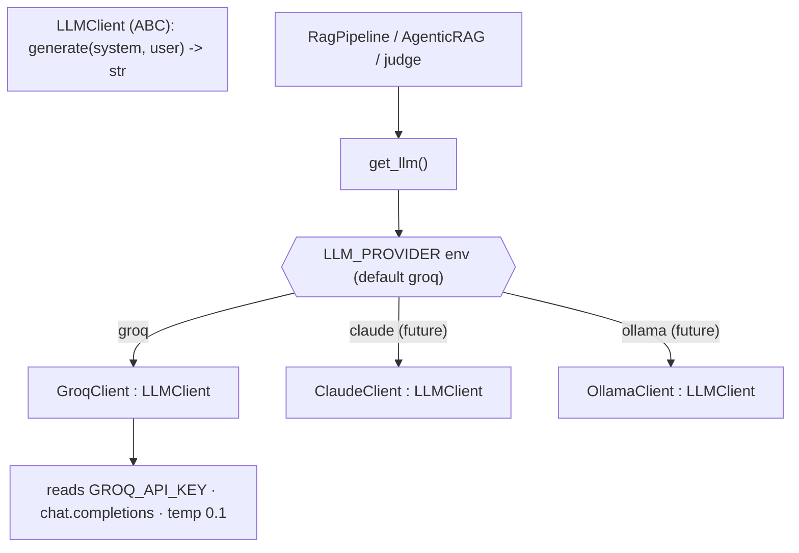

# 11 — LLM Abstraction: The Swappable `LLMClient` Interface, Groq Adapter & Factory

*Subsystem: how the whole system talks to a language model without being married to one vendor. Code:
`src/llm/base.py`, `src/llm/groq_client.py`, `src/llm/__init__.py` (`get_llm`).*

---

## 1. The Claim

> *"Hid every LLM provider behind a one-method `LLMClient` interface with a provider factory, so the RAG
> logic never imports a vendor — swapping Groq → Claude/Gemini/Ollama is one `elif` and an env var,
> with the API key read from the environment (never hard-coded)."*

---

## 2. First Principles (from zero)

- **Provider coupling** = if your code calls `groq.chat.completions.create(...)` directly in many
  places, the vendor is smeared across the codebase; switching providers becomes a hunt-and-replace
  refactor.
- **Program to an interface, not an implementation.** Define the *capability* you need ("generate text
  from a system + user message") as an abstract contract; let each vendor provide a concrete adapter.
  Callers depend only on the contract.
- **Adapter pattern** = a small class that translates a vendor's specific SDK into your common interface.
- **Factory** = a function that returns the right concrete implementation based on config (an env var),
  so callers don't construct vendors themselves.
- **Dependency injection (light).** The pipeline calls `get_llm()` to obtain *some* `LLMClient` — it
  neither knows nor cares which one.
- **Secrets via environment.** API keys come from environment variables (`.env` locally, platform
  secrets in the cloud), never committed to source.
- **System vs user message.** The interface takes both (standing rules vs this turn's content), matching
  how chat models are prompted (F2).

---

## 3. How It Actually Works Under the Hood

**One tiny contract.** `LLMClient` is an ABC with a single abstract method:
`generate(system, user) -> str`. That's the entire surface the rest of the app depends on — deliberately
minimal so any provider can implement it and nothing leaks vendor specifics.

**A concrete adapter.** `GroqClient` implements it: in `__init__` it reads `GROQ_API_KEY` from the
environment (raising a *helpful* error with signup instructions if missing — a nice DX touch), picks a
model (`GROQ_MODEL` env or a strong default `llama-3.3-70b-versatile`), and in `generate` it maps the
`(system, user)` pair to Groq's `chat.completions` message format at `temperature=0.1`, returning the
text. All Groq-specific knowledge lives *only* here.

**A provider factory.** `get_llm()` reads `LLM_PROVIDER` (default `groq`) and returns the matching
adapter; unknown providers raise. Adding Claude/Gemini/Ollama is a new adapter class + one `elif` — the
commented stubs are already in the code. Callers (`RagPipeline`, the agent, the judge) all obtain their
LLM via `get_llm()`, so a provider switch touches exactly one file.

**Why this is the backbone of "swappable by design."** Every "I could swap the model in one line" claim
in the README rests here. Because the pipeline holds an `LLMClient` (not a `GroqClient`), and resolves it
through the factory, changing `LLM_PROVIDER=claude` re-points generation, decomposition, and judging all
at once — with zero edits to retrieval, prompting, or the agent.

---

## 4. Diagram

### ASCII — one interface, many providers
```
        callers: RagPipeline · AgenticRAG · judge_faithfulness
                         │  all call get_llm()
                         ▼
                 ┌──────────────────┐   LLM_PROVIDER env
                 │   get_llm()      │──────────────────────┐
                 │   (factory)      │                      │
                 └────────┬─────────┘                      │
                          │ returns an LLMClient           │
                          ▼                                 ▼
              ┌───────────────────────┐        (future) elif provider ==
              │  LLMClient (ABC)      │           "claude" → ClaudeClient
              │   generate(system,user)│          "gemini" → GeminiClient
              └───────────┬───────────┘           "ollama" → OllamaClient
                          ▼  implements
                 ┌───────────────────┐   reads GROQ_API_KEY from env (never hard-coded)
                 │   GroqClient      │   maps (system,user) → chat.completions, temp 0.1
                 └───────────────────┘
```

### Mermaid — factory + adapters


---

## 5. How It Works in Code-Intel Engine (real code)

**The one-method contract (`src/llm/base.py`):**
```python
class LLMClient(ABC):
    @abstractmethod
    def generate(self, system: str, user: str) -> str:
        """Send a system instruction + user message, return the model's text reply."""
```

**The Groq adapter — all vendor specifics isolated here (`src/llm/groq_client.py`):**
```python
DEFAULT_MODEL = "llama-3.3-70b-versatile"

class GroqClient(LLMClient):
    def __init__(self, model=None):
        api_key = os.environ.get("GROQ_API_KEY")           # secret from env, never hard-coded
        if not api_key:
            raise RuntimeError("GROQ_API_KEY is not set. Get a FREE key at https://console.groq.com ...")
        self.client = Groq(api_key=api_key)
        self.model = model or os.environ.get("GROQ_MODEL", DEFAULT_MODEL)

    def generate(self, system, user):
        resp = self.client.chat.completions.create(
            model=self.model,
            messages=[{"role": "system", "content": system}, {"role": "user", "content": user}],
            temperature=0.1,                                # focused, factual (F2)
        )
        return resp.choices[0].message.content or ""
```

**The provider factory (`src/llm/__init__.py`):**
```python
def get_llm() -> LLMClient:
    provider = os.environ.get("LLM_PROVIDER", "groq").lower()
    if provider == "groq":
        return GroqClient()
    # elif provider == "claude": return ClaudeClient()   ← swap is one adapter + one elif
    raise ValueError(f"Unknown LLM_PROVIDER: {provider!r}")
```

---

## 6. Why I Chose This

- **An interface + factory** so the RAG logic depends on a capability, not a vendor. Every "swap the
  model in one line" claim is *true* because of this seam — and it makes the codebase resilient to a
  provider deprecating a model or changing pricing.
- **Groq (Llama 3.3)** because it serves strong open models *free* and *fast* — ideal for a
  demo/learning project — while GPT-4/Claude cost per call and Ollama needs a capable local GPU.
- **`temperature=0.1`** centralized in the adapter so every call (generation, decomposition, judging) is
  faithful and repeatable by default (F2).
- **API key from the environment** with a helpful missing-key error — never a committed secret, and a
  smooth first-run experience.
- **A single `generate(system, user)` method** — the smallest contract that covers every LLM use in the
  project (answering, decomposing, judging), so adapters are trivial to write.

---

## 7. Alternatives + Comparison Table

| Concern | Chosen | Alternative | Why NOT (here) |
|---|---|---|---|
| Provider access | **`LLMClient` interface + factory** | Call the Groq SDK directly everywhere | Vendor smeared across the codebase; swapping becomes a refactor |
| LLM host | **Groq (free, fast open models)** | OpenAI GPT-4 / Anthropic Claude | Paid per call; behind the interface I can still swap to them in one line |
| LLM host | **Groq** | Local Ollama | Needs a capable local GPU; Groq is zero-setup and fast |
| Config | **Env var (`LLM_PROVIDER`, `GROQ_MODEL`)** | Hard-coded provider/model | Env config swaps provider/model with no code change |
| Secrets | **Env / platform secrets** | Hard-coded API key | Never commit secrets; env works locally and in the cloud |
| Contract size | **One method (`generate`)** | A fat interface (streaming, tools, embeddings…) | YAGNI — one method covers every use here; grow it only when needed |

---

## 8. Scenarios & Edge Cases

1. **Swap to Claude.** Add a `ClaudeClient(LLMClient)`, add one `elif` in `get_llm`, set
   `LLM_PROVIDER=claude` — generation, decomposition, and judging all switch; retrieval/prompting/agent
   untouched.
2. **Change model, same provider.** Set `GROQ_MODEL=llama-3.1-8b-instant` for a faster/cheaper run — no
   code change.
3. **Missing API key.** `GroqClient.__init__` raises a clear, actionable error (with the signup URL)
   instead of a cryptic SDK failure; entry points catch it and print it cleanly.
4. **Model returns empty content.** `generate` coalesces to `""` so callers never get `None`.
5. **Unknown provider.** `get_llm` raises `ValueError` early — fail fast with a clear message.
6. **Deployment secrets.** On Streamlit Cloud the key comes from `st.secrets` and is copied into
   `os.environ`, so the same env-reading adapter works unchanged (file 13).

---

## 9. How I Verified It

- **The interface is exercised by three distinct callers** — `RagPipeline.answer`, the agent's
  decompose/generate, and `judge_faithfulness` — all via `get_llm()`; if the abstraction were leaky,
  one of them would need vendor-specific code, and none does.
- **Swappability is concrete, not aspirational:** the factory's `elif` structure + env var means a new
  provider is an adapter class plus one line, and the stubs are already commented in.
- **Secret handling is verified by the failure path:** with no `GROQ_API_KEY`, every entry point prints
  the helpful setup message rather than crashing deep in the SDK.

---

## 10. Interview Q&A (easy → hard)

**Q (easy). Why hide the LLM behind an interface?** "So the rest of the system depends on a capability —
'generate text from a system + user message' — not on a specific vendor. That means I can swap providers
by changing one line, and no vendor detail leaks into the RAG logic."

**Q (easy). How would you switch from Groq to Claude?** "Write a `ClaudeClient` that implements
`LLMClient`, add one `elif` in the `get_llm` factory, and set `LLM_PROVIDER=claude`. Nothing in
retrieval, prompting, or the agent changes."

**Q (medium). What design patterns are here?** "Adapter — each provider class adapts a vendor SDK to my
`LLMClient` interface; and Factory — `get_llm` returns the right adapter based on an env var. Callers get
their LLM by dependency injection via `get_llm()`."

**Q (medium). Why is the interface just one method?** "YAGNI. Every LLM use in the project — answering,
decomposing, judging — needs only 'system + user → text'. A minimal contract makes adapters trivial and
avoids speculative surface I don't use. I'd add streaming or tool-calling only when a feature needs it."

**Q (medium). How do you handle the API key?** "Read from the environment — `.env` locally, platform
secrets in the cloud — never hard-coded. If it's missing, the client raises a clear error with the
signup URL, so first-run is smooth."

**Q (hard). Why Groq specifically, and isn't that a lock-in?** "Groq serves strong open Llama models
free and very fast, which is perfect for a demo — GPT-4/Claude cost money and Ollama needs a local GPU.
It's *not* lock-in precisely because it's behind `LLMClient`: the only Groq-specific code is one adapter
file, and switching is one `elif`. I optimized for cost/speed now without closing the door."

**Q (hard). Where does temperature live and why there?** "In the adapter's `generate`, set to 0.1, so
every call across the system — generation, decomposition, judging — is faithful and repeatable by
default. Centralizing it means I don't risk one call path drifting to a creative temperature."

**Q (curveball). What if a provider's API shape is very different?** "That's exactly what the adapter
absorbs. The adapter's job is to translate my uniform `(system, user)` call into whatever that vendor
expects and normalize the response back to a string. The interface stays stable; the messiness is
quarantined in one file per provider."

---

## 11. Traps to Avoid

- ❌ Don't call the Groq SDK directly in the pipeline/agent — everything goes through `get_llm()`.
- ❌ Don't hard-code the API key — read it from the environment.
- ❌ Don't over-design the interface — one method covers every use; grow it on demand.
- ❌ Don't present Groq as lock-in — the adapter + factory make it a one-line swap.
- ❌ Don't scatter temperature across call sites — it's centralized in the adapter.

---

⬅️ Prev: [`10-agentic-loop.md`](10-agentic-loop.md) ·
➡️ Next: [`12-evaluation-and-judge.md`](12-evaluation-and-judge.md) ·
🔗 Related: [`01-architecture-and-pipeline.md`](01-architecture-and-pipeline.md), [`F2-llms-tokens-prompting.md`](F2-llms-tokens-prompting.md)
