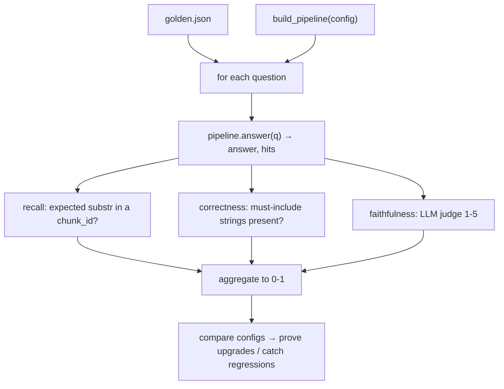

# 12 — Evaluation: Golden Set, Three Metrics & LLM-as-Judge

*Subsystem: how "I think it's good" becomes "here are the numbers". Code: `evaluate.py`,
`src/eval/judge.py`, `tests/golden.json`.*

---

## 1. The Claim

> *"Built an evaluation harness that scores each retrieval config against a hand-curated golden set on
> three metrics — context recall, answer correctness, and faithfulness (LLM-as-judge) — so every
> upgrade (dense → hybrid → rerank) is *proven* to help and regressions are caught, not guessed."*

---

## 2. First Principles (from zero)

- **Why evaluate at all?** RAG has many knobs (chunking, retriever, fusion, reranking, prompt). Without
  measurement, "I improved it" is a vibe. An eval harness turns changes into numbers so you can compare
  configs and catch regressions.
- **Golden set** = a small, hand-curated list of questions with known expectations (which chunk holds
  the answer, what fact the answer must contain, whether it's even answerable). It's the ruler.
- **Context Recall** = *did retrieval fetch the chunk that actually holds the answer?* This isolates the
  retrieval quality from the generation quality — the most important RAG metric, because if the right
  chunk isn't retrieved, nothing downstream can fix it.
- **Answer Correctness** = *does the final answer contain the key fact(s) we expected?* A cheap,
  deterministic check via substring matching.
- **Faithfulness** = *is every claim in the answer supported by its sources (no hallucination)?* This is
  semantic, so it's scored by an **LLM-as-judge** (1–5), not by rules.
- **LLM-as-judge** = using an LLM to grade an output against a rubric. Great for fuzzy criteria; runs
  **offline** (only during eval / the agent's self-check), so it never slows real users.
- **Unanswerable question** = a deliberate case whose *correct* answer is a refusal — it tests that the
  system says "I couldn't find that" instead of hallucinating.

---

## 3. How It Actually Works Under the Hood

**One config in, a scores table out.** `evaluate.py <config>` builds the named pipeline via the factory
(dense | hybrid | hybrid_rerank) and runs every golden question through it, printing a per-question row
and three aggregate scores. Because all configs share the `RagPipeline` interface (file 01), the
comparison is apples-to-apples.

**Three metrics, computed per question.**
- **Context recall** — only for answerable questions with an `expected_chunk_substr`: check whether any
  retrieved `chunk_id` contains that substring. Aggregated as hits / answerable-total.
- **Answer correctness** — check that every string in `answer_must_include` appears in the answer
  (case-insensitive). For the unanswerable question, `answer_must_include: ["couldn't find"]` cleverly
  reuses the same mechanism to assert the *refusal*.
- **Faithfulness** — call `judge_faithfulness(question, answer, hits)`; average the 1–5 scores and
  normalize to 0–1.

**The judge itself.** `judge_faithfulness` sends the LLM a strict grader prompt with the question,
answer, and sources, asking for a **single integer 1–5** (5 = every claim supported; 1 = fabricated). It
regex-extracts the digit and defaults to 3 if the model returns junk — so a malformed grade never
crashes evaluation. It runs on the same swappable `LLMClient` as everything else (file 11).

**Why normalize everything to 0–1.** So the three metrics sit on one comparable scale in the summary,
making config-vs-config comparison legible at a glance.

**Honest framing of the numbers.** On a small/clean corpus the scores can be near-perfect (the README
shows dense and hybrid both at recall 1.0, correctness 1.0, faithfulness 0.87). The harness's *real*
value is on larger, noisier corpora, where it's how hybrid/rerank get tuned and regressions are caught —
and I say that explicitly rather than overselling a tiny sample.

---

## 4. Diagram

### ASCII — the measurement loop
```
  tests/golden.json                        build_pipeline(config)   ← factory (dense|hybrid|hybrid_rerank)
  [{question, expected_chunk_substr,             │
    answer_must_include, unanswerable}]          ▼
        │ for each question:                 pipeline.answer(q) → (answer, hits)
        ▼                                         │
  ┌─────────────────────────────────────────────┼──────────────────────────────┐
  │ 1 CONTEXT RECALL : expected_substr in any retrieved chunk_id?  (yes/NO)     │
  │ 2 CORRECTNESS    : all answer_must_include present in answer?  (yes/NO)     │
  │ 3 FAITHFULNESS   : judge_faithfulness(q, answer, hits) → 1..5   (LLM judge) │
  └─────────────────────────────────────────────┬──────────────────────────────┘
                                                 ▼
                 aggregate → Context Recall, Answer Correctness, Faithfulness (all 0-1)
              compare configs → PROVE dense → hybrid → hybrid_rerank helps / catch regressions
```

### Mermaid — scoring one config


---

## 5. How It Works in Code-Intel Engine (real code)

**The golden set shape (`tests/golden.json`):**
```json
{ "id": "q2_overdraw", "question": "What happens if I withdraw more than my balance?",
  "expected_chunk_substr": "withdraw", "answer_must_include": ["insufficient"] }
{ "id": "q6_unanswerable", "question": "How do I reset my forgotten password?",
  "unanswerable": true, "answer_must_include": ["couldn't find"] }   // refusal is the correct answer
```

**Three metrics per question (`evaluate.py`):**
```python
answer, hits = pipeline.answer(question); ids = [h["chunk_id"] for h in hits]
# 1. context recall (answerable only)
if expected: recall_hits += int(any(expected in cid for cid in ids)); recall_total += 1
# 2. answer correctness
answer_ok = all(m.lower() in answer.lower() for m in item.get("answer_must_include", []))
# 3. faithfulness (LLM judge, 1-5)
faith_scores.append(judge_faithfulness(question, answer, hits))
# aggregate (all normalized 0-1)
context_recall = recall_hits / recall_total
answer_correctness = correct / len(golden)
faithfulness = (sum(faith_scores)/len(faith_scores)) / 5
```

**The LLM judge (`src/eval/judge.py`):**
```python
_JUDGE_SYSTEM = """You are a strict grader measuring FAITHFULNESS... Reply with ONLY a single integer 1-5..."""
def judge_faithfulness(question, answer, hits):
    sources = "\n\n".join(f"[{i}] {h['content']}" for i, h in enumerate(hits, 1))
    raw = get_llm().generate(_JUDGE_SYSTEM, f"QUESTION:\n{question}\n\nANSWER:\n{answer}\n\nSOURCES:\n{sources}")
    m = re.search(r"[1-5]", raw.strip())
    return int(m.group()) if m else 3        # robust to non-numeric output
```

---

## 6. Why I Chose This

- **Measure, don't guess.** RAG has too many knobs to tune by intuition; a golden-set harness makes each
  change provable and catches regressions — it's the difference between engineering and vibes.
- **Three complementary metrics** because they isolate different failure modes: recall = did retrieval
  find it; correctness = did the answer contain the fact; faithfulness = did it stay grounded. A single
  metric would hide problems.
- **Context recall first** because it's the root cause of most RAG failures — if the answer chunk isn't
  retrieved, no prompt or model fixes it. Measuring it directly tells me whether to invest in retrieval.
- **LLM-as-judge for faithfulness** because rules can't measure "is every claim supported"; an LLM can,
  and running it offline keeps user latency clean.
- **A hand-curated golden set with an unanswerable case** because a small honest ruler (that also tests
  *refusal*) is more trustworthy than many auto-generated questions of unknown quality.
- **Normalize to 0–1** so configs compare at a glance.

---

## 7. Alternatives + Comparison Table

| Concern | Chosen | Alternative | Why NOT (here) |
|---|---|---|---|
| Quality signal | **Golden-set harness** | "Looks good to me" / manual spot-checks | Vibes miss regressions; numbers make changes provable |
| Overlap metric | **Fact-inclusion + LLM judge** | BLEU / ROUGE | Measure surface word-overlap, not grounding/correctness — wrong target for RAG |
| Faithfulness | **LLM-as-judge (1-5)** | Regex/keyword rules | Faithfulness is semantic; rules miss paraphrase and nuance |
| Faithfulness | **LLM-as-judge** | Human-only review | Doesn't scale per-change; the judge is automatable and runs offline |
| Test data | **Hand-curated golden set** | Auto-generated questions | Small honest set (incl. a refusal case) beats many questions of unknown quality |
| Retrieval metric | **Context recall (chunk found?)** | Answer-only metrics | Answer metrics hide *why* it failed; recall isolates retrieval |
| Judge robustness | **Regex-extract, default 3** | Trust raw LLM output | A non-numeric reply would otherwise crash eval |

---

## 8. Scenarios & Edge Cases

1. **Compare configs.** `evaluate.py dense` vs `hybrid` vs `hybrid_rerank` on the same golden set —
   directly shows whether each upgrade raises recall/correctness/faithfulness.
2. **Retrieval regression.** A chunking or embedding change that stops fetching the answer chunk drops
   *context recall* immediately — caught before it ships.
3. **Hallucination creep.** A prompt tweak that loosens grounding lowers the *faithfulness* score even if
   correctness looks fine — the judge catches what substring checks can't.
4. **Unanswerable question.** The system must refuse; `answer_must_include: ["couldn't find"]` asserts it
   does — a guard against the model inventing an answer.
5. **Judge returns "the answer is 4/5".** The regex extracts `4`; a garbled reply defaults to 3 — eval
   never crashes.
6. **Tiny clean corpus.** Scores near 1.0 — I frame these as directional and note the harness's real
   value is on larger, noisier corpora (honest, not oversold).

---

## 9. How I Verified It (…that the eval itself is meaningful)

- **The metrics move for the right reasons:** break retrieval and *context recall* falls; loosen the
  grounding prompt and *faithfulness* falls; remove the refusal rule and the unanswerable case fails
  *correctness*. Each metric is pinned to a specific failure mode.
- **The harness is the verification tool for the rest of the project** — files 02–10 point back here,
  because "did chunking/hybrid/rerank actually help?" is answered by re-running `evaluate.py`.
- **Reproducible & swappable:** the judge uses the same `LLMClient` interface (file 11), and results are
  deterministic-ish at temperature 0.1, so re-runs are comparable.
- **Honest reporting:** the README publishes the actual sample numbers *and* the caveat that they're on a
  small corpus — verification includes stating the limits.

---

## 10. Interview Q&A (easy → hard)

**Q (easy). How do you know your RAG system is any good?** "I measure it. A golden set of questions with
known answers, scored on context recall, answer correctness, and faithfulness. Every change gets
re-scored, so improvements are proven and regressions are caught."

**Q (easy). What's context recall and why is it first?** "Did retrieval fetch the chunk that actually
holds the answer. It's first because it's the root cause of most RAG failures — if the right chunk isn't
retrieved, no prompt or model can save the answer."

**Q (medium). What are your three metrics and what does each catch?** "Context recall — did we retrieve
the answer chunk (isolates retrieval). Answer correctness — does the answer contain the expected fact
(cheap, deterministic). Faithfulness — is every claim supported by the sources, scored by an LLM judge
(catches hallucination). Together they separate retrieval from generation problems."

**Q (medium). What is LLM-as-judge and why use it here?** "Using an LLM to grade an output. Faithfulness
is semantic — you can't check 'is every claim supported' with string rules, but an LLM can. I give it the
question, answer, and sources and ask for a 1–5. It runs offline, so it never slows real users."

**Q (medium). Why include an unanswerable question?** "To test that the system *refuses* instead of
hallucinating. Its correct answer is 'I couldn't find that', which I assert with the same must-include
check. It guards the safe-refusal behavior."

**Q (hard). Why not BLEU/ROUGE?** "They measure surface word overlap with a reference, which isn't what
matters for RAG. An answer can be correct and faithful with totally different wording, or overlap-heavy
and wrong. My metrics target grounding and fact-inclusion, which is what actually matters."

**Q (hard). Your sample scores are ~1.0 — isn't that suspicious?** "On a small, clean corpus, yes —
near-perfect is expected and I say so explicitly. The harness's value isn't the absolute number on a toy
set; it's catching regressions and tuning hybrid/rerank on larger, noisier corpora. I'd rather report the
honest caveat than oversell a tiny sample."

**Q (curveball). Isn't LLM-as-judge unreliable?** "It's a signal, not gospel — which is why it's one of
three metrics, runs at low temperature with a strict rubric, and is robust to bad output (regex-extract,
default 3). For faithfulness specifically it correlates well with human judgment and scales per-change in
a way manual review can't."

---

## 11. Traps to Avoid

- ❌ Don't claim quality without measurement — the whole point is numbers over vibes.
- ❌ Don't conflate correctness and faithfulness — one checks facts present, the other checks grounding.
- ❌ Don't propose BLEU/ROUGE — they measure the wrong thing for RAG.
- ❌ Don't oversell tiny-corpus scores — state the caveat; the value is regression-catching at scale.
- ❌ Don't forget the unanswerable case — testing *refusal* is as important as testing answers.
- ❌ Don't let a non-numeric judge reply crash eval — extract/ default.

---

⬅️ Prev: [`11-llm-abstraction.md`](11-llm-abstraction.md) ·
➡️ Next: [`13-ui-and-deployment.md`](13-ui-and-deployment.md) ·
🔗 Related: [`10-agentic-loop.md`](10-agentic-loop.md), [`07-hybrid-retrieval-rrf.md`](07-hybrid-retrieval-rrf.md)
