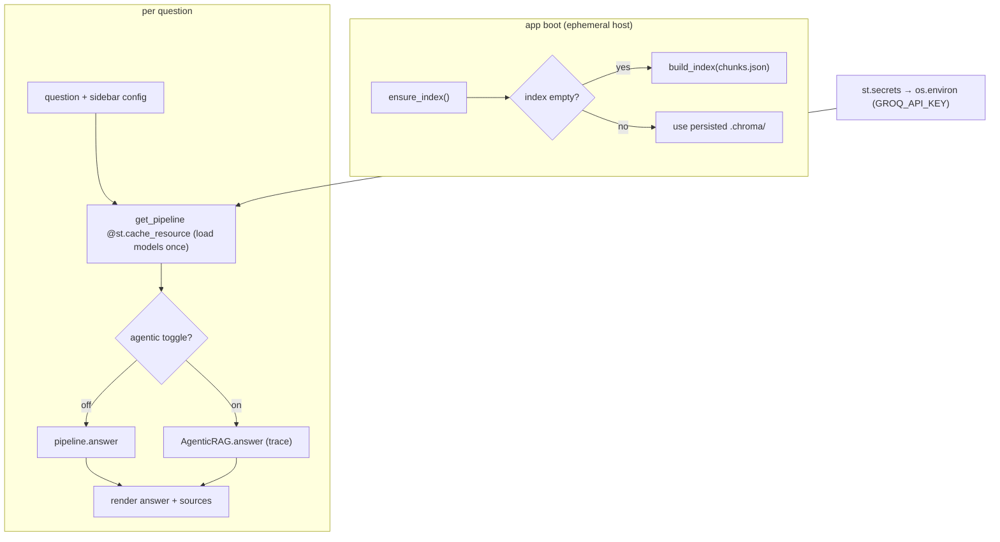

# 13 — UI & Deployment: Streamlit, Model Caching & the Ephemeral-FS Index Rebuild

*Subsystem: the web UI and the deployment realities that shape it. Code: `app.py`, `src/indexing.py`
(`ensure_index`), plus the `.gitignore` decision to ship `chunks.json` but not `.chroma/`.*

---

## 1. The Claim

> *"Shipped a Streamlit chat UI with a retrieval-strategy selector and an agentic-mode toggle, cached
> the heavy models once per process with `@st.cache_resource`, wired secrets from the platform, and made
> the app self-heal its index on ephemeral hosts by rebuilding from the committed `chunks.json`."*

---

## 2. First Principles (from zero)

- **Why a UI at all?** The engine is Python functions; a UI makes it usable by non-CLI users and
  demoable in a browser. The value is *access*, not new logic.
- **Streamlit** = a Python library that turns a script into a web app — widgets (`text_input`,
  `selectbox`, `toggle`) are function calls, and the script re-runs top-to-bottom on every interaction.
- **The re-run model.** Because Streamlit re-executes the whole script per interaction, anything
  *expensive* (loading ML models, building the index) must be **cached**, or every click would reload
  hundreds of MB of models.
- **`@st.cache_resource`** = cache a heavy, non-serializable object (a model, a pipeline) once per
  process and reuse it across re-runs and users.
- **Ephemeral filesystem** = many hosts (Streamlit Cloud, containers) wipe local files on restart. A
  built binary index (`.chroma/`) can vanish; the app must be able to rebuild it.
- **Secrets management** = API keys come from the platform's secret store in the cloud and a `.env`
  locally — never committed.

---

## 3. How It Actually Works Under the Hood

**The UI is a thin shell over the pipeline.** `app.py` renders a title, a sidebar with a **retrieval
strategy** selectbox (`hybrid_rerank | hybrid | dense`) and an **agentic mode** toggle, and a question
box. On submit it builds/gets the pipeline, runs either `pipeline.answer` or
`AgenticRAG(...).answer`, and renders the answer, an optional agent trace (sub-questions + faithfulness
scores), and the **sources** in expanders. All the intelligence lives in the same pipeline/agent the CLI
uses — the UI adds no logic, just controls and display.

**Model caching is the key performance move.** `get_pipeline(config)` is wrapped in
`@st.cache_resource`, so the embedding model, cross-encoder, and vector store load **once** per process
(and per config) instead of on every question. Without it, Streamlit's re-run-on-every-interaction model
would reload heavy models on each click — seconds of latency per keystroke-submit.

**Secrets bridge for the cloud.** Locally the Groq key comes from `.env`. On Streamlit Cloud it comes
from the platform's secrets box; `app.py` copies `st.secrets["GROQ_API_KEY"]` into `os.environ` so the
existing env-reading `GroqClient` (file 11) works unchanged in both places. One adapter, two
environments.

**Self-healing index on ephemeral hosts.** The built `.chroma/` folder is large, opaque, and gets wiped
on restart, so it's git-ignored; instead the small, diffable `chunks.json` is committed. `ensure_index`
(file 04) checks `VectorStore().count() == 0` on boot and rebuilds the index from `chunks.json` if it's
missing — so the app reconstructs its own searchable index on first run in a fresh environment. That's
the deployment insight: **ship the cheap source artifact, regenerate the expensive derived one.**

**Graceful failure.** A missing key surfaces as a clean `st.error` (from the `RuntimeError` the client
raises, file 11) instead of a stack trace, and the sidebar tells the user how to index their data.

---

## 4. Diagram

### ASCII — the deployed app
```
  BROWSER (Streamlit)                        PROCESS (cached once)                 DEPLOY
  ┌───────────────────────────┐              @st.cache_resource                    ┌───────────────┐
  │ sidebar: strategy select   │  submit ───► get_pipeline(config)  ◄── load once ─│ embed model   │
  │         agentic toggle      │             │  (embedder, reranker, store)         │ cross-encoder │
  │ question box                │             ▼                                     │ vector store  │
  │ answer + trace + sources    │◄─ render ── answer OR AgenticRAG.answer           └───────────────┘
  └───────────────────────────┘                                                    boot: ensure_index()
        secrets: st.secrets["GROQ_API_KEY"] → os.environ                            count==0 ? rebuild
                (so GroqClient reads it unchanged)                                  from chunks.json
```

### Mermaid — request + boot paths


---

## 5. How It Works in Code-Intel Engine (real code)

**Cache heavy models once (`app.py`):**
```python
@st.cache_resource(show_spinner="Loading models & index...")
def get_pipeline(config: str):
    return build_pipeline(config=config, chunks_path="chunks.json")   # loaded once per process/config
```

**Secrets bridge for local + cloud (`app.py`):**
```python
try:
    if "GROQ_API_KEY" in st.secrets:
        os.environ["GROQ_API_KEY"] = st.secrets["GROQ_API_KEY"]   # cloud → env, so GroqClient works unchanged
except Exception:
    pass                                                          # local: .env handles it
```

**Strategy + agentic controls and grounded rendering (`app.py`):**
```python
config = st.selectbox("Retrieval strategy", ["hybrid_rerank", "hybrid", "dense"])
agent_mode = st.toggle("Agentic mode", value=False)
...
answer, hits, trace = AgenticRAG(pipeline, max_retries=1).answer(question) if agent_mode \
                      else (*pipeline.answer(question), None)
st.write(answer)
for i, hit in enumerate(hits, 1):
    with st.expander(f"[{i}] {hit['chunk_id']}"):
        st.code(hit["content"])          # always show the sources behind the answer
```

**Self-healing index (`src/indexing.py`):**
```python
def ensure_index(chunks_path="chunks.json"):
    if VectorStore().count() == 0:       # fresh/ephemeral host → rebuild from the committed artifact
        build_index(chunks_path)
```

---

## 6. Why I Chose This

- **Streamlit** because it turns the existing Python pipeline into a shippable web demo in ~80 lines — a
  React+API stack would be a whole separate project for zero added capability here.
- **`@st.cache_resource`** because Streamlit re-runs the script on every interaction; without caching,
  the heavy embed/rerank models would reload per click. Caching is the difference between a snappy and an
  unusable app.
- **Ship `chunks.json`, rebuild `.chroma/` on boot** because hosted disks are ephemeral and the binary
  index is large/opaque; regenerating the expensive derived artifact from a small committed source is the
  robust pattern.
- **Secrets from the platform → env** so the same env-reading LLM client works locally and in the cloud
  with no special-casing.
- **Always render the sources** so the UI preserves the project's core value — grounded, *verifiable*
  answers (file 09) — not just a chat bubble.
- **Expose strategy + agentic mode** so the UI can *demonstrate* the dense→hybrid→rerank progression and
  the agent — the exact things the deep-dives defend.

---

## 7. Alternatives + Comparison Table

| Concern | Chosen | Alternative | Why NOT (here) |
|---|---|---|---|
| UI | **Streamlit** | React/Next.js + FastAPI | A separate frontend+API project for no added capability; Streamlit ships the demo fast |
| UI | **Streamlit** | Gradio | Comparable; Streamlit's layout/sidebar/caching fit a multi-control app slightly better |
| Model loading | **`@st.cache_resource`** | Reload per interaction | Streamlit re-runs the script each click; reloading heavy models makes it unusable |
| Deploy index | **Ship chunks.json, rebuild on boot** | Commit `.chroma/` | Large opaque binary; ephemeral disks wipe it; chunks.json is small + diffable |
| Secrets | **Platform secrets → env** | Hard-code / commit key | Never commit secrets; the env bridge works in both environments |
| Answer display | **Show sources in expanders** | Answer text only | Hides provenance; verifiable sources are the project's whole point |

---

## 8. Scenarios & Edge Cases

1. **User submits several questions.** Models are cached, so only the first is slow (loading); the rest
   are fast — the caching payoff.
2. **Deploy to a fresh Streamlit Cloud host.** `.chroma/` is absent → `ensure_index` rebuilds from
   `chunks.json` on boot; the app is searchable without any manual step.
3. **Switch retrieval strategy in the sidebar.** `get_pipeline` caches per config, so each strategy loads
   once and is reused when reselected.
4. **Toggle agentic mode on a hard question.** Runs the decompose/critique loop and shows the trace
   (sub-questions + faithfulness scores), demoing the agent (file 10).
5. **Missing API key in the cloud.** The secrets bridge finds nothing → `GroqClient` raises → the UI
   shows a clean `st.error` with setup guidance, not a crash.
6. **Big index on a small host.** Rebuild-on-boot keeps the repo light and avoids committing a huge
   binary; the trade-off is a one-time boot cost, which is acceptable for a demo.

---

## 9. How I Verified It

- **Caching is observable:** the first question shows the "Loading models & index..." spinner; subsequent
  questions skip it — direct evidence `@st.cache_resource` loads once.
- **The rebuild path is real:** on a fresh environment with no `.chroma/`, `ensure_index` reconstructs
  the index from `chunks.json` (the same `build_index` the CLI uses), so the deployed app self-heals.
- **The secrets bridge is verified by both environments:** locally `.env` supplies the key; in the cloud
  `st.secrets` does, and the identical `GroqClient` works in both because it only reads `os.environ`.
- **Grounding survives into the UI:** every answer renders its sources in expanders, so the deployed demo
  is as verifiable as the CLI.

---

## 10. Interview Q&A (easy → hard)

**Q (easy). Why Streamlit and not a React frontend?** "The engine is already Python functions; Streamlit
turns them into a web app in ~80 lines. A React+API stack would be a whole separate project for no extra
capability. For a demo, Streamlit is the fastest path to something shippable."

**Q (easy). What does the UI actually add?** "Access and demoability — a strategy selector, an agentic
toggle, and rendered sources. No new logic; it drives the same pipeline and agent the CLI uses."

**Q (medium). Why cache the models, and how?** "Streamlit re-runs the whole script on every interaction,
so without caching it would reload the embedding and cross-encoder models on every click — seconds each.
`@st.cache_resource` loads them once per process and reuses them, so only the first question is slow."

**Q (medium). How do you handle deployment where the filesystem is wiped?** "I don't commit the built
`.chroma/` — it's large, opaque, and gets wiped. I commit the small `chunks.json` and call `ensure_index`
on boot: if the index is empty, it rebuilds from chunks.json. The app regenerates its own index on first
run."

**Q (medium). How do secrets work across local and cloud?** "The `GroqClient` only reads
`os.environ["GROQ_API_KEY"]`. Locally that comes from `.env`; in the cloud I copy `st.secrets` into
`os.environ` at startup. Same client, two environments, no hard-coded key."

**Q (hard). What's the general principle behind shipping chunks.json but not .chroma/?** "Commit the
cheap *source* artifact, regenerate the expensive *derived* one. chunks.json is small, diffable, and
enough to rebuild the index; the vector store is a large binary derivative that's better recomputed than
stored. It also keeps the repo light and the index reproducible."

**Q (hard). What breaks if you forget `@st.cache_resource`?** "Every interaction reloads the embedding
and cross-encoder models — hundreds of MB, several seconds — making the app effectively unusable. The
cache is what makes Streamlit's re-run model viable for an ML app."

**Q (curveball). Downsides of Streamlit here?** "It's single-process and not built for high-concurrency
production traffic, and the re-run model needs care around caching and state. For a demo/portfolio app
that's fine; for real traffic I'd put the pipeline behind a FastAPI service and a proper frontend — the
logic wouldn't change because it's all behind the pipeline/agent interfaces."

---

## 11. Traps to Avoid

- ❌ Don't forget `@st.cache_resource` — the re-run model reloads heavy models without it.
- ❌ Don't say you commit `.chroma/` — you ship chunks.json and rebuild on boot.
- ❌ Don't hard-code the API key — bridge platform secrets into the env.
- ❌ Don't drop the sources in the UI — verifiable grounding is the project's point.
- ❌ Don't oversell Streamlit as production-scale — it's a great demo; FastAPI+frontend is the scale path.

---

⬅️ Prev: [`12-evaluation-and-judge.md`](12-evaluation-and-judge.md) ·
➡️ Next: [`90-TECH-STACK-CHEATSHEET.md`](90-TECH-STACK-CHEATSHEET.md) · [`99-MASTER-interview-questions.md`](99-MASTER-interview-questions.md) ·
🔗 Related: [`04-vector-store-and-ann.md`](04-vector-store-and-ann.md), [`11-llm-abstraction.md`](11-llm-abstraction.md)
