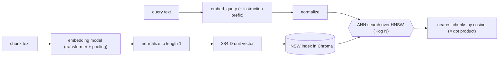

# F1 — Vectors, Embeddings, Similarity & ANN (the "search" math from zero)

*Fundamentals primer (Part 0). Behind **every** retrieval line in this project. Code it grounds:
`src/embeddings/embedder.py`, `src/store/vector_store.py`, `src/retrieval/*`.*

> **Why this file exists.** Before an interviewer asks about *your* hybrid retriever, they'll ask the
> basics: "what's an embedding?", "cosine vs Euclidean?", "why normalize?", "what's ANN and why not
> just compare against everything?". If those are shaky, the clever stuff never lands. This makes the
> math bulletproof, using this repo's real components as the running example.

---

## 1. The Claim

> *"Represented every code/doc chunk as a normalized dense embedding and searched them with
> approximate nearest-neighbour (HNSW) over cosine similarity — understanding the vector-space
> mechanics, not just calling a library."*

---

## 2. First Principles (from zero)

- **Vector** = an ordered list of numbers, e.g. `[0.12, -0.04, …]`. Geometrically, a point/arrow in
  space. A 384-dimensional vector is just a point in 384-D space (we can't picture it, but the math is
  identical to 2-D).
- **Embedding** = a vector produced by a neural network *so that meaning becomes geometry*: texts with
  similar meaning get vectors that point in similar directions. "How do I deposit money?" and "adding
  funds to an account" land near each other even with no shared words.
- **Dense vs sparse vector.** A **dense** embedding has mostly non-zero numbers packed into a few
  hundred dimensions (meaning, compressed). A **sparse** vector (what BM25/TF-IDF use) has one
  dimension per vocabulary word and is mostly zeros (exact words, not meaning). This project uses
  **both** (files 05 and 06).
- **Similarity** = a number saying how "close" two vectors are. More similar meaning → higher score.
- **Cosine similarity** = the cosine of the angle between two vectors: `cos θ = (A·B)/(|A||B|)`. It
  measures **direction**, ignoring length. `1` = same direction (identical meaning), `0` = orthogonal
  (unrelated), `-1` = opposite.
- **Cosine distance** = `1 − cosine similarity` (0 = identical, up to 2 = opposite). Databases often
  return *distance*; you flip it to *similarity* for readability.
- **Euclidean (L2) distance** = straight-line distance between the points. Sensitive to length/magnitude.
- **Normalization** = scaling a vector to length 1 (unit vector). After normalizing, `|A|=|B|=1`, so
  cosine similarity **= the dot product** `A·B` — a single fast multiply-add, and length no longer skews
  results.
- **Nearest-neighbour (NN) search** = "given a query vector, find the stored vectors closest to it."
- **Approximate NN (ANN)** = find the *near*-closest very fast by not checking everything. **HNSW**
  (Hierarchical Navigable Small World) is the popular ANN index: a layered graph you "walk" toward the
  query in ~logarithmic time.

---

## 3. How It Actually Works Under the Hood

**From text to geometry.** The embedding model tokenizes text, runs it through a transformer, and
pools the token vectors into one fixed-length vector (384 numbers for bge-small). Training pushed
similar-meaning texts together and different-meaning texts apart, so **distance in the vector space ≈
difference in meaning**. That's the whole trick that makes "search by meaning" possible.

**Why normalize (the detail that matters).** Two chunks about the same topic can differ in length; an
un-normalized dot product would reward the longer one just for having bigger numbers. Normalizing every
vector to length 1 removes magnitude, so comparison is purely about *direction* (meaning). Bonus: with
unit vectors, `cosine = dot product`, which is a cheap operation the ANN index can do millions of times.
This repo passes `normalize_embeddings=True` for exactly this reason.

**Why ANN instead of brute force.** Brute force compares the query to *every* stored vector — O(N) per
query. Fine for hundreds of chunks; painful at tens of thousands, and hopeless at millions. HNSW builds
a multi-layer graph where each node links to a few neighbours; a search enters at the top (coarse) layer
and greedily hops toward the query, descending layers to refine — reaching a very-close neighbour in
roughly O(log N) hops. You trade a tiny bit of recall (it's *approximate*) for orders-of-magnitude speed.

**Query/document asymmetry.** Some models (bge included) are trained so a *question* and a *passage*
should be embedded slightly differently — the question gets a short instruction prefix. Using the same
mode for both quietly lowers recall. So retrieval quality depends on embedding queries and documents
with the *right* method (file 03).

---

## 4. Diagram

### ASCII — meaning becomes geometry; ANN finds neighbours
```
  TEXT                         EMBEDDING (384-D, normalized)         VECTOR SPACE (shown as 2-D)
  "deposit money"   ──model──► [0.10, -0.22, ... ]  ─┐                     • deposit
  "add funds"       ──model──► [0.11, -0.19, ... ]  ─┤ close directions →  • add funds   (near)
  "delete user"     ──model──► [-0.31, 0.40, ... ]  ─┘ far direction    →       • delete user (far)

  QUERY "how to add money" ─► q vector ─► ANN(HNSW): walk graph toward q, don't scan all N
        cos(q, deposit) = 0.83   cos(q, add funds) = 0.86   cos(q, delete user) = 0.05
        → return the two nearest (add funds, deposit)
```

### Mermaid — the similarity + ANN flow


---

## 5. How It Works in Code-Intel Engine (real code)

**Normalized embeddings so cosine = dot product (`src/embeddings/embedder.py`):**
```python
vectors = self.model.encode(
    texts,
    normalize_embeddings=True,   # every vector length 1 → cosine == dot product
    batch_size=64,
)
```

**Cosine-space ANN index (`src/store/vector_store.py`):**
```python
self.collection = self.client.get_or_create_collection(
    name=collection,
    metadata={"hnsw:space": "cosine"},   # HNSW graph, compared with cosine distance
)
# query returns a cosine DISTANCE; we flip it to a similarity for humans:
"similarity": round(1.0 - dist, 4)       # 1.0 = identical meaning
```

**Dense = these vectors; sparse = BM25's word counts (contrast, files 05/06):**
```python
# dense (meaning):   embed_query(text) → 384 floats → nearest vectors
# sparse (keywords): BM25 over tokenized word counts → exact-term match
```

---

## 6. Why I Chose This (the vector-space design)

- **Embeddings turn "compare meaning" into "compare geometry"**, which a computer can do fast. That's
  the entire premise of semantic search and RAG.
- **Cosine on normalized vectors** is the standard for text similarity because meaning is about
  *direction*, not magnitude — and normalization makes it a single cheap dot product the index loves.
- **HNSW/ANN** because retrieval must stay fast as the corpus grows; brute force doesn't. The small
  recall sacrifice is invisible in practice and worth the speed.
- **A small local model (384-D)** hits the sweet spot of quality vs speed/RAM for a single-machine
  project, and the store interface lets me scale the index later without touching retrieval logic.

---

## 7. Alternatives + Comparison Table

| Concept | Chosen | Alternative | Why NOT (here) |
|---|---|---|---|
| Similarity metric | **Cosine (normalized)** | Euclidean/L2 | L2 is magnitude-sensitive; text similarity is about direction, so cosine is the right fit |
| Similarity metric | **Cosine** | Raw dot product on un-normalized vectors | Longer texts get bigger dot products unfairly; normalizing fixes it and makes cosine==dot |
| Search | **ANN (HNSW)** | Brute-force flat scan | O(N) per query — doesn't scale; HNSW is ~log N with negligible recall loss |
| Search | **HNSW** | IVF (inverted file) | IVF needs a training/clustering step and tuning; HNSW works well out of the box for this scale |
| Representation | **Dense embeddings** | Sparse (TF-IDF/BM25) only | Sparse can't match paraphrases/meaning; I use dense for meaning **and** BM25 for exact terms (hybrid) |
| Dimensionality | **384-D (small model)** | 1024-D (large model) | Marginal recall gain for more RAM/latency at this corpus size; swappable if needed |

---

## 8. Scenarios & Edge Cases

1. **Paraphrase, no shared words.** Query "add funds" vs chunk "deposit money" → high cosine because
   the model learned they mean the same thing. (Dense wins here.)
2. **Exact identifier.** Query `P2002` → dense may rank it mediocre (rare token, weak semantics), but
   BM25 nails the exact match — why hybrid exists (file 07).
3. **Un-normalized vectors.** If I skipped normalization, a long verbose chunk could beat a short exact
   one purely on magnitude — a subtle recall bug.
4. **Wrong query mode.** Embedding a question as a *document* (no instruction prefix) measurably lowers
   recall — a silent quality leak (file 03).
5. **Tiny corpus.** With only a handful of chunks, ANN and brute force return the same thing; ANN's win
   only shows at scale.
6. **Opposite meaning.** "enable X" vs "disable X" can be *closer* than you'd expect (they share
   context) — a known embedding limitation that reranking (file 08) helps correct.

---

## 9. How I Verified It

- **The similarity numbers are observable:** `ask.py` prints each source's score, and `search.py`/the
  store return `similarity = 1 − distance`, so I can eyeball that on-topic chunks score high and
  unrelated ones score low.
- **The evaluation harness** (file 12) measures *context recall* — did the vector search actually
  retrieve the chunk holding the answer? — turning "the math feels right" into a number.
- **Sanity check by construction:** normalized vectors always have length 1 (dot product of a vector
  with itself ≈ 1), which is why cosine and dot product agree.

---

## 10. Interview Q&A (easy → hard)

**Q (easy). What is an embedding?** "A vector produced by a neural net so that similar-meaning text
maps to nearby vectors. It turns 'compare meaning' into 'compare geometry', which a computer does fast."

**Q (easy). Dense vs sparse vectors?** "Dense embeddings pack meaning into a few hundred non-zero
numbers; sparse vectors (TF-IDF/BM25) have one dimension per word and are mostly zeros — exact words,
not meaning. I use dense for semantics and sparse BM25 for exact identifiers."

**Q (medium). Cosine vs Euclidean — which and why?** "Cosine, because text similarity is about
*direction* in the space, not magnitude. Two chunks on the same topic but different lengths should
still match; cosine ignores length, Euclidean wouldn't."

**Q (medium). Why normalize your embeddings?** "So every vector has length 1. Then cosine similarity
equals the dot product — a single cheap operation the index runs constantly — and length can't skew
results toward longer chunks."

**Q (medium). What's ANN and why not brute force?** "Approximate Nearest Neighbour finds the closest
vectors without scanning all of them. Brute force is O(N) per query and doesn't scale; HNSW walks a
layered graph toward the query in ~log N time, trading a hair of recall for huge speed."

**Q (hard). Explain HNSW in one minute.** "It's a multi-layer graph. Upper layers are sparse
(long-range links), lower layers dense. A search starts at the top, greedily hops to the neighbour
closest to the query, and when it can't get closer, drops a layer and refines. You reach a very close
neighbour in logarithmic hops instead of a linear scan. It's approximate because the greedy walk can
miss the exact best, but in practice recall is very high."

**Q (hard). Where do embeddings fail, and how do you compensate?** "They're weak on exact tokens (rare
identifiers, error codes) and can rate antonyms as similar because they share context. I compensate
with BM25 for exact matches (hybrid, file 07) and a cross-encoder reranker that reads query+chunk
together to fix ordering (file 08)."

**Q (curveball). Your model is 384-D — is bigger always better?** "No. Larger models give somewhat
better recall but cost more RAM and latency. At this corpus size the small model is the right point on
the curve, and because embeddings sit behind a wrapper I can swap to a larger one and re-index without
touching retrieval."

---

## 11. Traps to Avoid

- ❌ Don't say cosine "measures distance" — it measures the *angle*/direction; distance is `1 − cosine`.
- ❌ Don't forget normalization is what makes cosine == dot product (and kills length bias).
- ❌ Don't claim ANN is exact — it's approximate; that's the whole speed trade-off.
- ❌ Don't say dense embeddings handle exact identifiers well — that's BM25's job.
- ❌ Don't conflate "dense" (many non-zero dims) with "large" (many dims) — bge-small is dense but only 384-D.

---

➡️ Next: [`F2-llms-tokens-prompting.md`](F2-llms-tokens-prompting.md) ·
🔗 Related: [`03-embeddings-model.md`](03-embeddings-model.md),
[`04-vector-store-and-ann.md`](04-vector-store-and-ann.md), [`05-dense-retrieval.md`](05-dense-retrieval.md)
