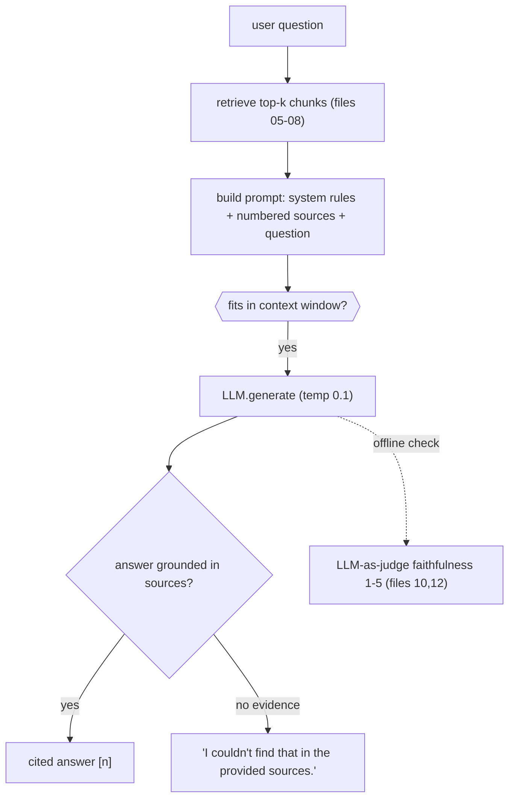

# F2 — LLMs, Tokens, Context Windows, Prompting & Hallucination (from zero)

*Fundamentals primer (Part 0). Behind **every** generation line in this project. Code it grounds:
`src/llm/*`, `src/rag/pipeline.py`, `src/agent/agent.py`, `src/eval/judge.py`.*

> **Why this file exists.** RAG is *retrieval* + *an LLM*. Interviewers will probe the LLM basics
> before your clever agent loop: "what's a token?", "what's a context window?", "what is hallucination
> and how does RAG fight it?", "system vs user message?", "why temperature 0.1?". Nail these and every
> generation answer becomes easy.

---

## 1. The Claim

> *"Generated grounded, cited answers with a hosted LLM under strict low-temperature prompting, and
> used the same LLM as an offline judge — with a clear mental model of tokens, context windows, and
> hallucination driving every prompt decision."*

---

## 2. First Principles (from zero)

- **LLM (Large Language Model)** = a neural network trained to predict the next **token** given the
  preceding text. Everything it "does" (answering, summarizing, reasoning) is repeated next-token
  prediction. It has **no live memory** and **no access to your files** unless you put them in the
  prompt — which is the entire reason RAG exists.
- **Token** = a chunk of text the model reads/writes — roughly ¾ of a word in English (e.g. "deposit"
  ≈ 1 token, "evaluateServiceability" ≈ several). Models think in tokens, and cost/limits are counted
  in tokens.
- **Context window** = the maximum number of tokens the model can consider at once (prompt + answer).
  Everything the model "knows" for this call must fit here. Too much retrieved text → it overflows or
  gets diluted; too little → the answer isn't grounded.
- **Prompt** = the text you send. Two roles matter here:
  - **System message** = standing instructions / the model's "job description" (tone, rules,
    constraints). It frames the whole conversation.
  - **User message** = the actual request/content for this turn (here: the sources + the question).
- **Temperature** = a knob (0 → ~2) controlling randomness in next-token choice. Low = focused,
  deterministic, repeatable; high = creative, varied. RAG wants **low**.
- **Hallucination** = the model stating something fluent and confident that isn't true / isn't
  supported by the sources. It happens because the model predicts *plausible* text, not *verified*
  text.
- **RAG (Retrieval-Augmented Generation)** = retrieve relevant source text, put it in the prompt, and
  instruct the model to answer **only** from it (with citations). It grounds the model in *your* data
  and is the primary defense against hallucination.
- **LLM-as-judge** = using an LLM to *grade* an output (e.g., "is this answer supported by these
  sources?"). Great for fuzzy, semantic criteria that rules can't measure.

---

## 3. How It Actually Works Under the Hood

**Generation is constrained next-token prediction.** You send `system + user` messages; the model
encodes them into tokens and generates tokens one at a time, each conditioned on everything so far, until
it emits a stop signal. At `temperature=0.1` it almost always picks the highest-probability next token,
so given the same sources it produces stable, focused answers — exactly what a factual RAG system wants.

**Why the context window forces retrieval to be selective.** The model can't read the whole repo — it
only sees what's in the prompt, bounded by the window. So the pipeline retrieves a *small* set of the
most relevant chunks (top-k after rerank) and formats them as numbered sources. This is why chunking
quality (file 02) and retrieval precision (files 07–08) directly determine answer quality: garbage or
missing context in → hallucinated or "can't find it" out.

**How prompting fights hallucination here.** The system prompt does four concrete things: (1) *"use
ONLY the numbered sources"* (no outside knowledge), (2) *"cite every claim with [n]"* (forces
attribution), (3) *"if the sources don't contain it, say exactly: I couldn't find that…"* (a safe
refusal instead of a guess), and (4) *"be concise and technical, never invent files/functions."* Low
temperature reinforces this by discouraging creative drift. None of this is a guarantee — which is why
the agent adds an LLM **faithfulness judge** and the eval harness *measures* it (files 10, 12).

**System vs user split matters.** Rules go in the system message so they persist and aren't confused
with content; the sources+question go in the user message. Mixing them (rules buried in user text) makes
the model more likely to treat instructions as data or vice-versa.

---

## 4. Diagram

### ASCII — a grounded generation call
```
  RETRIEVED SOURCES (top-k)          SYSTEM MESSAGE (rules)                USER MESSAGE
  [1] file: bank.py (deposit)   ┐    "Use ONLY the numbered sources.   ┐   "Sources:
  [2] file: bank.py (withdraw)  ├──► Cite each claim [n]. If not in    ├──►  [1]...[2]...
  [3] file: README (deploy)     ┘    sources, say 'I couldn't find'."  ┘    Question: how do I deposit?"
                                              │
                                              ▼   LLM (temperature 0.1)
                          next-token prediction constrained by the prompt
                                              │
                                              ▼
                 "Call deposit(amount)... [1]"   ← every claim cited, or a safe refusal
```

### Mermaid — RAG as the fix for the LLM's blindness


---

## 5. How It Works in Code-Intel Engine (real code)

**The grounding system prompt (`src/rag/pipeline.py`):**
```python
SYSTEM_PROMPT = """You are a precise codebase and documentation assistant.
Rules:
- Answer using ONLY the numbered sources provided. Do not use outside knowledge.
- Cite every claim with its source number in square brackets, e.g. [1], [2].
- If the sources do not contain the answer, reply exactly: "I couldn't find that in the provided sources."
- Be concise and technical. Never invent files, functions, or behavior that isn't in the sources."""
```

**System vs user split + low temperature (`src/llm/groq_client.py`):**
```python
response = self.client.chat.completions.create(
    model=self.model,
    messages=[
        {"role": "system", "content": system},   # standing rules
        {"role": "user",   "content": user},      # sources + question
    ],
    temperature=0.1,   # focused, factual, repeatable — not creative
)
```

**The same LLM as an offline faithfulness judge (`src/eval/judge.py`):**
```python
_JUDGE_SYSTEM = """You are a strict grader measuring FAITHFULNESS...
Reply with ONLY a single integer 1-5 (5 = every claim supported; 1 = fabricated)."""
# runs only during evaluation / agentic self-check → never slows real users
```

---

## 6. Why I Chose This

- **Prompt-level grounding over fine-tuning.** Instructing the model to use only the sources + cite is
  cheap, transparent, and effective; fine-tuning a model for grounding is expensive overkill when the
  answer already lives in the retrieved text.
- **Low temperature (0.1)** because a code assistant must be faithful and repeatable — the same
  question and sources should give the same answer, not a creative variation.
- **A hard refusal string** ("I couldn't find that…") so the system *fails safe*: no sources → no
  guess. This is directly testable (the golden set has an unanswerable question, file 12).
- **In-line `[n]` citations** so every claim is attributable and the UI can show exactly what grounded
  it — the single most useful anti-hallucination signal for a user.
- **LLM-as-judge for faithfulness** because "is every claim supported?" is semantic; rules can't
  measure it, and running it offline keeps user latency untouched.

---

## 7. Alternatives + Comparison Table

| Concern | Chosen | Alternative | Why NOT (here) |
|---|---|---|---|
| Grounding | **Strict prompt + citations** | Fine-tuning for grounding | Expensive, slow to iterate; the context already contains the answer |
| Grounding | **RAG (retrieve into prompt)** | Rely on the LLM's parametric memory | The model doesn't know *your* repo and would hallucinate; RAG injects real, current source text |
| Determinism | **temperature 0.1** | default temperature | Creativity causes drift/hallucination in a factual assistant |
| Refusal | **Explicit "couldn't find" string** | Let the model improvise when unsure | Improvising is where hallucination lives; a fixed refusal is safe and testable |
| Answer check | **LLM-as-judge (offline)** | Regex/keyword rules | Faithfulness is semantic; rules miss paraphrase and nuance |
| Long context | **Retrieve top-k, then rerank** | Stuff the whole repo into the prompt | Overflows the window, dilutes attention, costs more, and lowers accuracy |

---

## 8. Scenarios & Edge Cases

1. **Answer is in the sources.** Model composes it and cites `[1][2]`; low temperature keeps it tight.
2. **Answer is NOT in the sources.** Rules force the exact refusal string instead of a plausible guess
   — verified by the golden set's unanswerable question (file 12).
3. **Too many/too-long chunks.** Risk of overflowing the context window or diluting the key source —
   which is why retrieval keeps a small top-k and reranking puts the best first (files 07–08).
4. **Model tries to use outside knowledge.** The "ONLY the sources" rule + citations make ungrounded
   claims obvious (no `[n]`), and the judge scores them low.
5. **Ambiguous/multi-part question.** One retrieval may not cover all parts → the agent decomposes it
   into sub-questions first (file 10).
6. **Judge returns junk** (non-numeric). `judge.py` regex-extracts a 1–5 and defaults to 3, so a
   malformed grade never crashes evaluation.

---

## 9. How I Verified It

- **Faithfulness is measured, not assumed:** the eval harness reports a faithfulness score (LLM-judge,
  normalized 0–1) per config, and the agent uses the same judge to decide whether to retry (files
  10, 12).
- **The refusal path is unit-checked** by the golden set's `q6_unanswerable` case, which asserts the
  answer must include "couldn't find".
- **Citations are visible** in `ask.py` and the Streamlit UI — each answer lists the exact sources it
  was grounded in, so ungrounded claims are easy to spot.

---

## 10. Interview Q&A (easy → hard)

**Q (easy). What is a token?** "The unit an LLM reads and writes — roughly ¾ of an English word. Models
think in tokens, and limits/costs are counted in tokens; a long identifier can be several tokens."

**Q (easy). What is a context window?** "The max tokens the model can consider at once — prompt plus
answer. Everything it 'knows' for a call must fit there, which is why I retrieve a small, relevant set
of chunks rather than dumping the whole repo."

**Q (easy). System vs user message?** "The system message holds standing rules — 'use only the sources,
cite everything, refuse if absent'. The user message holds the actual content — the numbered sources and
the question. Keeping rules separate makes the model follow them reliably."

**Q (medium). What is hallucination and why does it happen?** "When the model states something fluent
but unsupported. It happens because an LLM predicts *plausible* next tokens, not *verified* facts. RAG
fights it by grounding the model in retrieved sources and forcing citations."

**Q (medium). How exactly does your prompt reduce hallucination?** "Four levers: use ONLY the numbered
sources, cite every claim with [n], output a fixed refusal if the answer isn't present, and never invent
files/functions — all at temperature 0.1 so it doesn't drift. Then I *measure* faithfulness with an
LLM judge rather than trusting the prompt alone."

**Q (medium). Why temperature 0.1?** "A code assistant should be faithful and repeatable. Low
temperature makes the model pick high-probability tokens, so the same question and sources give a stable,
grounded answer instead of a creative one."

**Q (hard). RAG vs fine-tuning — when each?** "Fine-tuning changes the model's weights — good for style,
format, or a fixed skill, but expensive and static, and it still won't know *today's* code. RAG injects
current, specific source text at query time and cites it — ideal when the answer lives in a corpus that
changes. For 'answer questions about this repo', RAG is the right tool; I'd only fine-tune for a
consistent output format if needed."

**Q (hard). Isn't LLM-as-judge circular — using an LLM to grade an LLM?** "It's a different task, so it's
not circular: generating a fluent answer is easy, but *verifying* each claim against given sources is a
narrower, more checkable job the model does well. It's a well-established technique, I keep it offline so
it never affects users, and I treat it as a signal alongside context recall and correctness — not the
only metric."

**Q (curveball). What if the sources contradict the model's training?** "The rules say use ONLY the
sources, so it should follow the sources and cite them. That's a feature — for questions about a specific
repo, the repo is ground truth, not the model's stale parametric memory."

---

## 11. Traps to Avoid

- ❌ Don't say the LLM "reads your files" — it only sees what retrieval puts in the prompt.
- ❌ Don't confuse words and tokens — identifiers can be several tokens; limits are token-counted.
- ❌ Don't claim the prompt *guarantees* no hallucination — it reduces it; the judge + eval *measure* it.
- ❌ Don't bury rules in the user message — they belong in the system message.
- ❌ Don't set a high temperature for a factual assistant.
- ❌ Don't say "just put the whole repo in the prompt" — it overflows the window and hurts accuracy.

---

⬅️ Prev: [`F1-vectors-embeddings-similarity.md`](F1-vectors-embeddings-similarity.md) ·
➡️ Next: [`01-architecture-and-pipeline.md`](01-architecture-and-pipeline.md) ·
🔗 Related: [`09-generation-and-citations.md`](09-generation-and-citations.md),
[`10-agentic-loop.md`](10-agentic-loop.md), [`12-evaluation-and-judge.md`](12-evaluation-and-judge.md)
